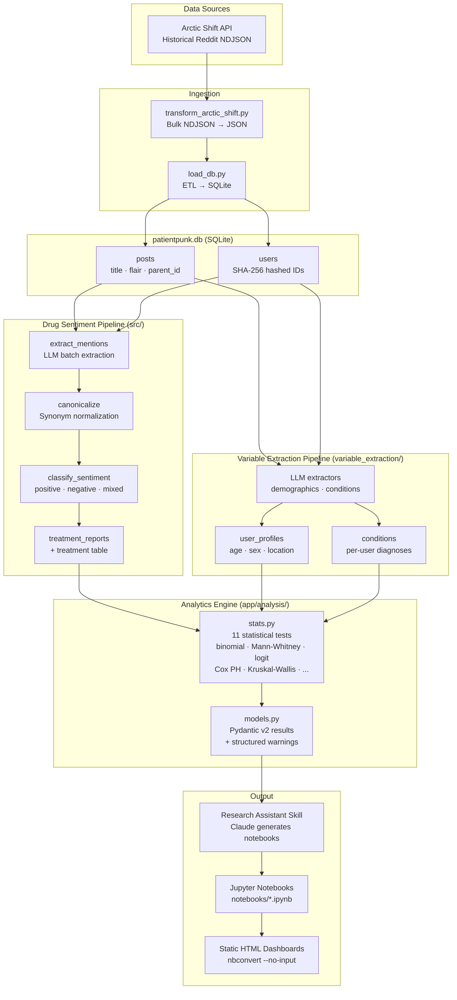

# PatientPunk — Architecture Diagram

## Key Design Decisions

| Decision | Why it matters |
|---|---|
| One data point per patient per drug | A patient who posts about LDN ten times counts as one opinion, not ten — preventing prolific posters from drowning out the rest of the community |
| Results report problems, they don't hide them | Every analysis flags when sample sizes are too small, when data is sparse, or when results are unreliable — so the reader always knows how much to trust a finding |
| Usernames are scrambled before storage | Patients are stored as anonymous IDs. The database cannot be used to identify or trace individual Reddit users |
| AI only reads the direct reply, not the whole thread | Without this limit, the AI would tag drugs mentioned earlier in a conversation onto unrelated replies. Restricting context reduced this error from 55% of reports to 8% |
| Cheap model for bulk extraction, powerful model for analysis | Processing 17,000 posts with a top-tier AI would cost hundreds of dollars. We use a fast, inexpensive model to scan for drug mentions and a more capable one only where nuanced judgment is needed |
| Results exported as clean web pages | Findings are shared as readable web pages — no code visible, no software required to open them |
