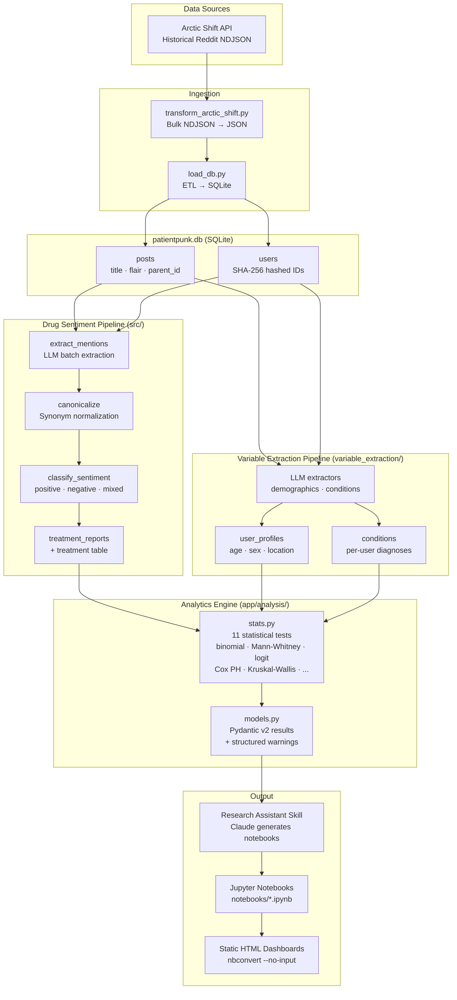

# PatientPunk — Architecture Diagram

## Key Design Decisions

| Decision | Rationale |
|---|---|
| User-level aggregation | One data point per user per drug satisfies statistical independence |
| Warning-oriented results | `AnalysisWarning(code, severity, message)` instead of exceptions — small samples are reported, not crashed |
| SHA-256 user hashing | Privacy-preserving join key across tables |
| `--max-upstream-depth 1` | Limits context bleed from 55% → 8% in drug extraction |
| OpenRouter by default | Single key switches between Haiku (fast/cheap) and Sonnet (strong) |
| `nbconvert --no-input` | Voila doesn't work reliably on Windows; static HTML is equivalent |
