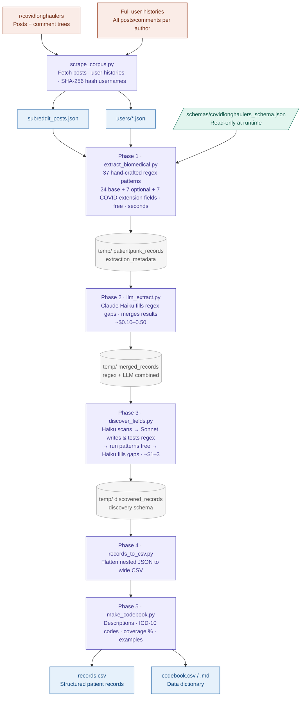

# PatientPunk Scrapers

Reddit corpus scraper for the PatientPunk project. Fetches posts, comment
trees, and author histories from r/covidlonghaulers using the
[Arctic Shift](https://arctic-shift.photon-reddit.com) public API — **no
Reddit API key required**.

> **Looking for the extraction pipeline?** It has moved to its own top-level
> directory: [`../demographic_extraction/`](../demographic_extraction/).
> See [`demographic_extraction/README.md`](../demographic_extraction/README.md)
> for pipeline docs, CLI reference, and library API.

---

## Project Structure

```
PatientPunk/
├── Scrapers/                        ← you are here
│   ├── scrape_corpus.py             # Reddit scraper (Arctic Shift API)
│   ├── requirements.txt             # Python dependencies
│   ├── SCRAPER_HELP.md              # Full flag reference and time estimates
│   ├── CONTRIBUTING.md              # Architecture and contributor guide
│   └── output/                      # Scraper output (corpus + pipeline results)
│       ├── subreddit_posts.json     # All posts in window
│       ├── users/*.json             # One file per author (--user-histories)
│       ├── records.csv              # Flattened demographic records
│       ├── codebook.csv             # Data dictionary
│       └── temp/                    # Pipeline intermediate files
│
├── demographic_extraction/          # Extraction pipeline (separate directory)
├── database_creation/               # Drug sentiment pipeline (Polina)
├── reddit_sample_data/              # Sample corpus for development/testing
└── docs/                            # Project documentation
```

---

## Quick Start

```bash
# Install dependencies
pip install -r requirements.txt

# Scrape the corpus (no API key needed)
python scrape_corpus.py --weeks 2 --comments

# Then run the extraction pipeline (from the project root):
cd ..
python demographic_extraction/main.py run \
    --schema demographic_extraction/schemas/covidlonghaulers_schema.json
```

Outputs: `Scrapers/output/records.csv` (flat data) and `Scrapers/output/codebook.csv` (data dictionary).

---

## The Extraction Pipeline

PatientPunk uses a layered extraction strategy — each step catches what the previous one missed, and the pipeline can discover and build new extraction patterns automatically.



> For the colour-coded HTML version open **[PatientPunk_Operationalization_Pipeline_Diagram.html](PatientPunk_Operationalization_Pipeline_Diagram.html)** in a browser.

### Full pipeline — commands and outputs

**Recommended: use `run_pipeline.py` to run everything in one command** (see [run_pipeline.py](#run_pipelinepy-full-pipeline-orchestrator) for all flags):

```bash
python demographic_extraction/run_pipeline.py \
    --schema demographic_extraction/schemas/covidlonghaulers_schema.json
```

**Alternative: run each step individually** (useful for debugging or re-running a single step):

```bash
# 1. Scrape the corpus (no API key needed)
python scrape_corpus.py --weeks 2 --comments

# 2. Regex extraction (free, seconds)
#    Note: extension fields with source="llm_discovered" are skipped here —
#    those are handled by discover_fields.py Phase 3 with per-text processing.
python demographic_extraction/extract_biomedical.py \
    --schema demographic_extraction/schemas/covidlonghaulers_schema.json

# 3. LLM fills gaps in the same fields (Haiku, ~$0.10-0.50)
#    First run: copy .env.example → .env and add your Anthropic API key
python demographic_extraction/llm_extract.py \
    --schema demographic_extraction/schemas/covidlonghaulers_schema.json

# 4. Discover new fields and merge them into the disease schema (~$1-3)
#    Each new field gets a _discovered_at timestamp; existing fields are never overwritten.
#    Phase 3 runs regex per text segment (not concatenated) to prevent cross-post bleed.
python demographic_extraction/discover_fields.py \
    --schema demographic_extraction/schemas/covidlonghaulers_schema.json

# 5. Flatten all records to CSV
python demographic_extraction/records_to_csv.py \
    --input output/merged_records_base.json \
            output/discovered_records_covidlonghaulers_v1.json

# 6. Generate codebook / data dictionary
python demographic_extraction/make_codebook.py \
    --schema demographic_extraction/schemas/covidlonghaulers_schema.json \
    --csv    output/records.csv
```

**What each step produces:**

| Step | Output file | What's in it |
|---|---|---|
| 1 | `output/subreddit_posts.json`, `output/users/` | Raw posts, comments, user histories |
| 2 | `output/patientpunk_records_{schema_id}.json` | Regex extractions — 24 base fields + hand-crafted extension fields |
| 3 | `output/merged_records_{schema_id}.json` | Regex + LLM combined — paraphrases, negation, treatment-outcome pairs filled in |
| 4 | `schemas/covidlonghaulers_schema.json` (updated), `output/discovered_records_{schema_id}.json` | New fields auto-discovered, regex validated, extracted across corpus |
| 5 | `output/records.csv` | One row per author+post, all fields flattened |
| 6 | `output/codebook.csv` | Data dictionary with descriptions, coverage %, and example values |

Steps 1-2 are free and have no API dependencies. Steps 3-4 require an Anthropic API key in `demographic_extraction/.env`. Step 4 is where the pipeline teaches itself new things.

Use `--limit` flags for cost-controlled test runs before committing to the full corpus:

```bash
python demographic_extraction/llm_extract.py --limit 5
python demographic_extraction/discover_fields.py --limit 20 --no-fill
# Or via the orchestrator:
python demographic_extraction/run_pipeline.py \
    --schema demographic_extraction/schemas/covidlonghaulers_schema.json \
    --limit 10 --no-discover
```

---

## run_pipeline.py (Full Pipeline Orchestrator)

Runs all five extraction steps in sequence with a single command. This is the recommended entry point after scraping.

### Usage

```bash
# Full run (all steps):
python demographic_extraction/run_pipeline.py \
    --schema demographic_extraction/schemas/covidlonghaulers_schema.json

# Free-only run (regex + CSV + codebook, no API calls):
python demographic_extraction/run_pipeline.py \
    --schema demographic_extraction/schemas/covidlonghaulers_schema.json \
    --no-llm --no-discover

# Cheap test run (10 records, skip discovery):
python demographic_extraction/run_pipeline.py \
    --schema demographic_extraction/schemas/covidlonghaulers_schema.json \
    --limit 10 --no-discover

# Resume from step 3 (discovery) after a crash:
python demographic_extraction/run_pipeline.py \
    --schema demographic_extraction/schemas/covidlonghaulers_schema.json \
    --start-at 3

# Markdown codebook:
python demographic_extraction/run_pipeline.py \
    --schema demographic_extraction/schemas/covidlonghaulers_schema.json \
    --codebook-format markdown
```

### Auto-detection of saved candidates

If `output/phase1_candidates.json` exists when step 3 runs, `run_pipeline.py` passes it to `discover_fields.py` automatically and prints a notice. This avoids re-spending Phase 1 tokens on repeat runs. Pass `--candidates` to override which file is used, or delete the file to force a fresh Phase 1 scan.

### Flags

| Flag | Default | Description |
|---|---|---|
| `--schema PATH` | (required) | Extension schema JSON (e.g. `schemas/covidlonghaulers_schema.json`) |
| `--input-dir PATH` | `output/` | Input/output directory shared by all steps |
| `--start-at N` | 1 | Start from step N (1–5), skipping earlier steps |
| `--no-llm` | off | Skip step 2 (llm_extract.py) |
| `--no-discover` | off | Skip step 3 (discover_fields.py) |
| `--candidates PATH` | auto-detect | Path to a saved `phase1_candidates.json` — skips Phase 1. Auto-detected from `output/phase1_candidates.json` if present. |
| `--no-fill` | off | Skip Phase 4 gap-filling inside discover_fields.py |
| `--sample N` | — | Randomly sample N corpus items for discover Phase 1 |
| `--workers N` | 10 | Concurrent API workers for LLM and discover steps |
| `--limit N` | — | Process at most N records (cost control / testing) |
| `--resume` | off | Resume interrupted LLM / discover runs |
| `--sep STR` | ` \| ` | Multi-value separator for the CSV |
| `--provenance` | off | Include `{field}__provenance` and `{field}__confidence` columns in CSV |
| `--codebook-format csv\|markdown` | `csv` | Output format for the codebook |

### Output

```
output/
  records.csv       # Flat CSV: one row per author+post, all fields
  codebook.csv      # Data dictionary (or codebook.md with --codebook-format markdown)
```

---

## scrape_corpus.py

Fetches posts, comment trees, and author histories from r/covidlonghaulers within a configurable time window.

### Setup

```bash
pip install -r requirements.txt
```

### Usage

```bash
python scrape_corpus.py                                   # posts only, last 2 months (default)
python scrape_corpus.py --weeks 1 --comments              # 1-week sample with comments
python scrape_corpus.py --months 3 --comments             # 3 months of posts + comments
python scrape_corpus.py --months 3 --comments \
    --user-histories                                      # + author histories (~4-6 hrs)
python scrape_corpus.py --months 3 --comments \
    --user-histories --enrich-profiles                    # everything (run overnight)

python scrape_corpus.py --help                            # full inline help
```

### Flags

| Flag | Description |
|---|---|
| `--months N` | Scrape posts from the last N months (default: 2) |
| `--weeks N` | Scrape posts from the last N weeks (mutually exclusive with `--months`) |
| `--comments` | Fetch full comment trees for every post |
| `--user-histories` | Scrape each post author's full Reddit history across all subreddits |
| `--enrich-profiles` | Fetch Reddit profile data per author: avatar, bio, karma, account age. Requires `--user-histories` |

See `SCRAPER_HELP.md` for time estimates and full documentation.

### Output

```
output/
  subreddit_posts.json      # All posts in window (+ comments if --comments)
  users/
    {sha256_hash}.json      # One file per unique post author (--user-histories only)
  corpus_metadata.json      # Run summary and stats
```

User files are written **incrementally** — if the script crashes mid-run, completed user files are preserved.

---

## Step 1: extract_biomedical.py (Regex)

Processes the scraper output and extracts structured biomedical signals from post and comment text using hand-crafted regex patterns. No API calls required — runs in seconds on the full corpus.

Extension fields with `source: "llm_discovered"` in the schema are **skipped** by this script — those are handled exclusively by `discover_fields.py` Phase 3, which runs regex per text segment (not across a concatenated blob) to prevent cross-post bleed and includes timeout protection for LLM-generated patterns.

### What it extracts

| Category | Fields |
|---|---|
| Demographics | Age, sex/gender, location (US state + country), occupation, ethnicity, BMI |
| Conditions | 60+ named conditions, time to diagnosis, misdiagnosis history, diagnosis source |
| Symptom history | Age at onset, trigger, duration, trajectory |
| Genetics | Family history, genetic testing and variants |
| Treatments | 80+ medications, dosage, outcomes, procedures, dietary and alternative interventions |
| Functional status | Work/disability status, activity level, mental health, social impact |
| Healthcare experience | Doctor dismissal, diagnostic odyssey length, costs, system access |
| Exposures | Toxic/environmental, trauma, hormonal events, prior infections |

### Usage

```bash
python demographic_extraction/extract_biomedical.py
python demographic_extraction/extract_biomedical.py --schema demographic_extraction/schemas/covidlonghaulers_schema.json
python demographic_extraction/extract_biomedical.py --text "I'm a 34F with POTS, diagnosed after 3 years"
```

### Output

```
output/
  patientpunk_records_base.json         # v2.0 records (base fields)
  patientpunk_records_{schema_id}.json  # With extension schema fields
  extraction_metadata_{schema_id}.json  # Field hit counts
```

Records are PatientPunk v2.0 format with ICD-10 candidates, provenance tracking, and confidence tiers. See `CONTRIBUTING.md` for the full data model.

---

## Step 2: llm_extract.py (Haiku)

Second-pass extractor using Claude Haiku. Fills the same schema fields as the regex extractor but catches things regex structurally cannot:

- **Paraphrased mentions** — "my heart races when I stand" → POTS
- **Negation** — "I don't have POTS" correctly excluded
- **Treatment-outcome pairs** — "LDN helped my brain fog but worsened sleep" → two linked outcomes
- **Temporal context** — "I had fatigue but it resolved" → past symptom, not current
- **Field suggestions** — surfaces new patterns the schema doesn't cover yet

### Setup

```bash
pip install -r requirements.txt
cd demographic_extraction
cp .env.example .env
# Edit .env — add your Anthropic API key from https://console.anthropic.com/settings/keys
```

### Usage

```bash
python demographic_extraction/llm_extract.py --text "34F, POTS and MCAS, LDN helped my brain fog"
python demographic_extraction/llm_extract.py --limit 5        # test run (5 records)
python demographic_extraction/llm_extract.py                  # full corpus (merge + gaps + 10 workers, all on by default)
python demographic_extraction/llm_extract.py --no-merge       # LLM records only, skip merge
python demographic_extraction/llm_extract.py --resume         # continue a previous run
python demographic_extraction/llm_extract.py --schema demographic_extraction/schemas/covidlonghaulers_schema.json
```

### Flags

| Flag | Default | Description |
|---|---|---|
| `--text "..."` | — | Test mode: extract from a single string |
| `--schema PATH` | — | Extension schema file (same format as regex extractor) |
| `--limit N` | — | Process at most N records (cost control) |
| `--workers N` | 10 | Concurrent API calls. Use `--workers 1` for sequential/debug |
| `--skip-threshold F` | 0.7 | Skip records where regex already filled ≥ this fraction of fields (0.0 disables) |
| `--resume` | off | Skip records already in the output file from a previous run |
| `--no-merge` | merge on | Disable combining with regex results |
| `--no-focus-gaps` | gaps on | Disable focused prompts (ask only about null fields) — send full prompt every time |
| `--input-dir PATH` | output/ | Custom output/ directory path |

### Output

```
output/
  llm_records_{schema_id}.json            # LLM extraction records (written incrementally)
  llm_field_suggestions_{schema_id}.json  # New field suggestions, ranked by frequency
  merged_records_{schema_id}.json         # Combined regex + LLM (--merge only)
```

### Merge provenance

Each field in the merged output tracks where it came from:
- `provenance: "both"` — regex and LLM agree (highest confidence)
- `provenance: "regex_only"` — only regex found values
- `provenance: "llm_only"` — only LLM found values (paraphrases, negation-aware, etc.)

### Cost estimate

Haiku is very cheap. For a 220-post corpus with ~3,400 comments, expect ~$0.10-0.50 total. Use `--limit 5` first to verify output quality.

---

## Step 3: discover_fields.py (Haiku + Sonnet)

The self-improving part of the pipeline. Automatically discovers new biomedical fields from the corpus, generates validated regex patterns for them, and extracts across the full dataset. Uses a two-model architecture:

| Phase | Model | What it does | Cost |
|---|---|---|---|
| Phase 1 | Haiku | Scan corpus, identify new field candidates with example snippets | Low |
| Phase 2 | Sonnet | Write regex patterns for each candidate, test against examples, iterate until passing | Low (10-30 calls) |
| Phase 3 | (none) | Run validated regex per text segment across full corpus — each segment matched individually to prevent cross-post bleed | Free |
| Phase 4 | Haiku | Fill gaps where regex missed — posts separated by `---NEW POST---`; Haiku instructed not to span boundaries | Low |

### How the Sonnet regex loop works

For each discovered field, the pipeline:
1. Sonnet receives the field description + example text snippets from Phase 1
2. Sonnet writes 2-6 regex patterns
3. The script **automatically tests** every pattern against every example
4. Sonnet receives detailed results: which examples PASSED (with captured vs. expected values), which FAILED, and any compile errors
5. Sonnet rewrites/improves patterns to catch the failures while preserving passes
6. Repeat up to 3 iterations or until 80%+ hit rate
7. If the final hit rate is >= 50%, the field is accepted; otherwise rejected

No human in the loop — Sonnet self-corrects based on its own test results.

### Usage

```bash
# Merge discoveries into your disease schema (recommended — builds a library over time)
python demographic_extraction/discover_fields.py \
    --schema demographic_extraction/schemas/covidlonghaulers_schema.json

# Cheap test run first (Phase 1 only, 20 records)
python demographic_extraction/discover_fields.py \
    --schema demographic_extraction/schemas/covidlonghaulers_schema.json \
    --limit 20 --no-fill

# Run again later — only genuinely new fields get added (existing ones are skipped)
python demographic_extraction/discover_fields.py \
    --schema demographic_extraction/schemas/covidlonghaulers_schema.json

# If Phase 2 crashes, skip Phase 1 (free) and resume from the saved candidates
python demographic_extraction/discover_fields.py \
    --schema demographic_extraction/schemas/covidlonghaulers_schema.json \
    --candidates output/phase1_candidates.json

# No --schema: creates a standalone discovered_{timestamp}.json instead
python demographic_extraction/discover_fields.py
```

### Flags

| Flag | Default | Description |
|---|---|---|
| `--schema PATH` | — | Disease-specific schema to update. New fields are merged in with `_discovered_at` timestamp; existing fields are never overwritten. Without this, a new `discovered_{timestamp}.json` is created. |
| `--candidates PATH` | — | Skip Phase 1 and load candidates from a saved `phase1_candidates.json`. Phase 1 is always saved to `output/phase1_candidates.json` — use this to resume after a Phase 2 crash without re-spending tokens. When running via `run_pipeline.py`, this file is auto-detected and passed automatically. |
| `--sample N` | — | Randomly sample N corpus items for Phase 1 (more representative than `--limit`, which takes the first N alphabetically) |
| `--per-item-chars N` | 0 (full text) | Max characters taken from each item before batching in Phase 1. `0` = send everything. Set to e.g. `3000` for ~4x cheaper Phase 1 once you're done testing. |
| `--limit N` | — | Hard cap on corpus items loaded (takes first N). Use `--sample` for a random subset instead. |
| `--workers N` | 10 | Concurrent API calls for Phase 1 and Phase 4. Use `--workers 1` for sequential/debug |
| `--resume` | off | Resume Phase 4 from an existing records file, skipping already-filled records |
| `--no-fill` | fill on | Skip Phase 4 (Haiku gap-filling) |
| `--input-dir PATH` | output/ | Custom output/ directory path |

### Output

```
# With --schema (recommended):
schemas/covidlonghaulers_schema.json          # Updated in place — new fields appended

# Without --schema:
schemas/discovered_{timestamp}.json           # New standalone schema file

output/
  discovered_records_{schema_id}.json         # Full extraction results (incremental saves)
  discovered_field_report_{schema_id}.json    # Discovery report + coverage stats
```

### Discovered field tagging

All auto-discovered fields carry `"source": "llm_discovered"` and `"_discovered_at": "<ISO timestamp>"` in the schema, distinguishing them from hand-crafted fields and recording when each one was found. Provenance per record:
- `"provenance": "regex"` — the auto-generated regex matched
- `"provenance": "llm_filled"` — regex missed, Haiku extracted it (lower confidence)

### Using the updated schema

After running discover_fields.py with `--schema`, the disease schema contains both hand-crafted and auto-discovered fields. Point the other scripts at the same file:

```bash
# Re-run regex extraction with all fields (hand-crafted + discovered)
python demographic_extraction/extract_biomedical.py \
    --schema demographic_extraction/schemas/covidlonghaulers_schema.json

# LLM gap-filling with all fields
python demographic_extraction/llm_extract.py \
    --schema demographic_extraction/schemas/covidlonghaulers_schema.json

# Or edit the schema — remove low-quality fields, tweak patterns, adjust confidence
```

### Cost estimate

For a 220-post corpus: Phase 1 ~$0.05-0.15, Phase 2 ~$0.50-2.00 (Sonnet, 10-30 fields x 1-3 iterations), Phase 4 ~$0.05-0.15. Total: roughly $1-3. Use `--limit 20 --no-fill` for a cheap test run first.

---

## Export: records_to_csv.py

Flattens the nested JSON extraction records into a single CSV file, one row per `(author, post)` pair. Multiple JSON files can be combined — records with the same author+post are merged into one row.

### Usage

```bash
cd demographic_extraction

# Base fields only (default):
python records_to_csv.py

# Base + discovered fields in one CSV:
python records_to_csv.py \
    --input ../output/merged_records_base.json \
            ../output/discovered_records_covidlonghaulers_v1.json

# Include provenance + confidence columns for every field:
python records_to_csv.py \
    --input ../output/merged_records_base.json \
            ../output/discovered_records_covidlonghaulers_v1.json \
    --provenance

# Custom separator for multi-value fields (default: " | "):
python records_to_csv.py --sep "; "
```

### Flags

| Flag | Default | Description |
|---|---|---|
| `--input PATH [PATH ...]` | `output/merged_records_base.json` | One or more JSON record files. Records with the same author+post are merged. |
| `--output PATH` | `output/records.csv` | Output CSV path |
| `--provenance` | off | Add `{field}__provenance` and `{field}__confidence` columns for every field |
| `--sep STR` | ` \| ` | Separator string for multi-value fields |

### Output

`output/records.csv` — one row per unique author+post. Multi-value fields (e.g. conditions with multiple diagnoses) are joined with `--sep`. Prints a coverage summary table on exit showing how many records had each field filled.

---

## Codebook: make_codebook.py

Generates a data dictionary / codebook for the CSV output — field descriptions, confidence ratings, ICD-10 codes, pattern counts, and (optionally) real coverage stats and example values drawn from the actual records.

### Usage

```bash
cd demographic_extraction

# Schema only (no data needed):
python make_codebook.py --schema schemas/covidlonghaulers_schema.json

# Full codebook with coverage + examples:
python make_codebook.py \
    --schema schemas/covidlonghaulers_schema.json \
    --csv    ../output/records.csv

# Markdown format (good for GitHub / docs):
python make_codebook.py \
    --schema schemas/covidlonghaulers_schema.json \
    --csv    ../output/records.csv \
    --format markdown

# Custom output path:
python make_codebook.py \
    --schema schemas/covidlonghaulers_schema.json \
    --csv    ../output/records.csv \
    --output ../output/codebook_covidlonghaulers.csv
```

### Flags

| Flag | Default | Description |
|---|---|---|
| `--schema PATH` | (required) | Extension schema JSON |
| `--base-schema PATH` | `schemas/base_schema.json` | Base schema JSON |
| `--csv PATH` | — | Records CSV from `records_to_csv.py`. Adds coverage % and example values. |
| `--output PATH` | `output/codebook.csv` / `.md` | Output path |
| `--format csv\|markdown` | `csv` | Output format |
| `--examples N` | 5 | Max example values to show per field |
| `--sep STR` | ` \| ` | Multi-value separator (must match what `records_to_csv.py` used) |

### Output columns

| Column | Description |
|---|---|
| `field` | Field name (CSV column header) |
| `source` | `base`, `base_optional`, `extension`, or `llm_discovered` |
| `description` | Human-readable description from the schema |
| `confidence` | `high`, `medium`, or `low` |
| `icd10` | ICD-10 code if assigned |
| `frequency_hint` | `common`, `occasional`, etc. (LLM-discovered fields only) |
| `research_value` | LLM's rationale for the field (discovered fields only) |
| `n_patterns` | Number of regex patterns for the field |
| `discovered_at` | ISO timestamp of when the field was auto-discovered |
| `n_filled` | Rows with a value (requires `--csv`) |
| `coverage_pct` | Fraction of rows filled (requires `--csv`) |
| `example_values` | Up to N real values from the corpus (requires `--csv`) |

---

## Data Source

All scripts use [Arctic Shift](https://arctic-shift.photon-reddit.com), a free public archive of Reddit data.

- No API key or developer registration needed
- No 1,000-item cap per user (unlike Reddit's official API)
- Profile metadata (avatar, bio, karma) requires a separate Reddit call via `--enrich-profiles`
- Data freshness: typically hours to days behind live Reddit

## Privacy

All usernames are SHA-256 hashed before being written to any output file. Raw usernames exist only in memory during the scrape.

The `output/` directory and `.env` (if present) are gitignored by default.
