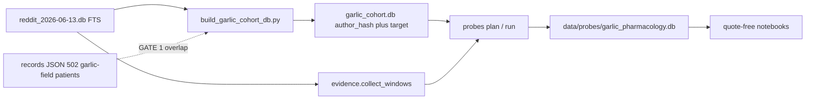

# Garlic beliefs and use in the long-COVID / ME-CFS Reddit corpus

**Status:** implemented. Quotes are short paraphrases, not verbatim spans. Per-author window-text dedup. GATE 4 marked complete by user 2026-08-12. Stage 5 done 2026-08-13 on `c05891b6…` (1,990 complete / 6 failed). Stage 5b done 2026-08-13 (38 complete / 11 failed / 1 left running; stopped by user). Stage 6 done 2026-08-13: [`docs/garlic_probe_run_report.md`](../../docs/garlic_probe_run_report.md). Analysis notebooks / loader remain out of scope (DESIGN §8 / §11).
**Date:** 2026-08-13.
**Engine contract:** PR 133 / [`probes/psychedelic_pharmacology/`](../../probes/psychedelic_pharmacology/) on the generic second-pass engine in [`probes/engine.py`](../../probes/engine.py).

This document is the study specification. Implementation lives in `probes/garlic_pharmacology/`, `scripts/build_garlic_cohort_db.py`, `tests/test_garlic_pharmacology.py`, and [`docs/garlic_probe_runbook.md`](../../docs/garlic_probe_runbook.md).

---

## 1. Questions

1. **Beliefs.** What does this community claim garlic *does* — antimicrobial / allicin / gut-biofilm versus histamine-MCAS / allium trigger, including **food-list** mentions (the modal anti-garlic speech)? Who is speaking (self, hearsay, named protocol)?
2. **Use.** Among reporters the probe labels as self + actual intervention use: preparation (raw clove, crush-and-wait, allicin supplement, Kyolic, other), any stated dose, self-attributed effects and adverse events. Power: a descriptive mix, not contrasts across eight preparations.
3. **Two folk systems.** How does allicin-for-biofilm talk differ from histamine / food-list talk? Personal “I quit garlic” is a rare third category, reported as preliminary if n stays below 30.
4. **Not asked.** Efficacy, causal effect, incidence, dose-response, or “garlic works for long COVID.” Every figure is a share of extractable reports. Silence is not absence.

Two folk systems share the word *garlic*. A cohort built from first-pass `treatment_outcome` would keep the people coded as taking a supplement and drop the food-list majority and much of the gut-allicin protocol talk.

---

## 2. Non-claims and privacy

The constraints in [`studies/psychedelics/_handoff.txt`](../psychedelics/_handoff.txt) §2 apply unchanged:

- Self-selected Reddit reporting cohort, not a clinical cohort.
- No efficacy, causal, incidence, or dose-response claims.
- Do not infer chronology from timestamps. Duration only if explicitly stated.
- An adverse-event percentage is a share of extractable reports, never incidence. State the denominator.
- `not_stated` is silence. Only `explicit_none` is a denial.
- Source-level events, not one summary per reporter. Contradictory exposures stay contradictory.
- Do not assign a stack outcome to garlic unless the source attributes it to garlic.
- Quote-bearing artifacts stay in the gitignored probe database. Do not commit them. Do not paste source text, quotes, or author hashes into this folder, a PR, or a report.
- First-pass JSON records are unstable at the person level (field-set agreement 36.5%, value agreement 58.8% on a repeated pass). Use them for GATE 1 overlap counts and as a methods check, not as the study population.

Additional garlic rules:

- Do not treat “garlic bread” as use.
- Do not treat a high-histamine food list as personal avoidance or as a negative efficacy outcome.
- Do not treat “I avoid garlic” as “garlic worsened my long COVID.”

---

## 3. Why this is not a psychedelic-schema clone

PR 133 extracts dose, effect, duration, and adverse events for people already known to report psilocybin, ketamine, or LSD. `included` means self + actual use. That contract throws away this study.

| Psychedelics (PR 133) | Garlic |
|---|---|
| Cohort from a prior extraction | That extraction keeps ~500 people and drops food-list + gut-allicin talk |
| `included` = self + actual_use | Beliefs and food lists *are* the study |
| Dose / route / AE | Preparation and polarity (pro-use vs trigger-food) are load-bearing |
| Culinary noise is irrelevant | Culinary vs medicinal must be classified, not regex-dropped |
| Avoidance is out of scope | Personal avoidance is rare; food-list anti-use is common |
| Quotes may lightly paraphrase | Quotes **must** be short paraphrases; verbatim spans are not the target |

Regex is retrieval only (keyword recall, bot/table filters). Identity, speech act, actual use, and attribution are model-labelled schema fields. That ruling from the psychedelic work stands: do not reintroduce identity regex gates.

---

## 4. Data available (validated 2026-08-12)

Readonly checks on `data/full_corpus_2026-07-31/records_covidlonghaulers_v2.json` (69,161 patients) and `reddit_2026-06-13.db` (FTS). Aggregates only.

### 4.1 Cohort size is real; the first-pass garlic label is not the population

| Source | Count |
|---|---|
| FTS `garlic OR allicin OR kyolic`, non-bot authors | **1,928** |
| FTS posts + comments | **3,980** |
| Paragraph-neighbor windows | **4,022** (~2.19M chars) |
| Estimated units at 6,000-char packing | **~2,015** |
| JSON patients with garlic in *any* field | **502** |
| JSON patients in meds / treatment_outcome / diet / alt / other_symptoms | **496** |
| FTS authors who are in the 69k JSON | **1,815** (94%) |
| FTS authors below `--min-items 3` (no JSON record) | **113** |
| FTS authors in the 69k with *no* garlic field | **1,315** |
| JSON ∩ FTS | **500 / 502** |

Those 4,022 windows are pre-dedup FTS spans. The probe drops identical bodies under distinct source ids (§6); the planned set is **3,873 windows / 1,996 units**.

The 1,315 are mostly not “missed treatments.” **536 authors (28%)** hit an onion / tomato / histamine **food-list** pattern. The first pass was right not to write those as `treatment_outcome`. They are still in-scope for beliefs.

Culinary-only (food terms without medicinal or avoid keys): **201 authors (~10%)**. Not a swamp. Do not regex-drop; the model classifies them. Cost waste is acceptable.

### 4.2 The two JSON-only rows are extractor hallucinations

JSON ∩ FTS is 500/502. The two misses are not a hash bug. Those accounts have 21 posts/comments in the Reddit database and **zero** tokens matching garlic, allicin, kyolic, clove, or allium. The JSON still records `raw garlic: helped: constipation` and `garlic: helped: bladder problems`.

GATE 1 reports this as a methods finding. Do not chase those two rows into the cohort.

### 4.3 `patientpunk.db` cannot supply this cohort

1,284 users, 25 `treatment_reports`, 26 treatments, **zero** garlic / allicin / kyolic. Same trap as PR 133: `cohort.sql` over `treatment_reports` would plan a successful empty run.

### 4.4 Two folk systems, not “avoidance vs use”

Personal avoidance is small:

- JSON diet-avoid-only: **11** patients
- Strict `I avoid … garlic` regex: **10** authors
- Looser avoid-phrase regex: **37** authors

An earlier “302 avoidance authors” count treated any low-histamine co-mention in a garlic document as avoidance. That is wrong.

Anti-garlic *belief* is common as lists and warnings: food-list **536** authors; MCAS / low-histamine co-mention **198** authors (10%). JSON `conditions` has four garlic-allergy rows; `other_symptoms` has intolerance and garlic-smell reports.

Pro-use exists but is not the FTS set:

- JSON medications or treatment_outcome: **408** patients
- Patient-level garlic treatment_outcome: helped 142, no_effect 16, worsened 12, mixed-across-mentions 6, unknown 2. Unusable as a headline (positive over-call + group attribution).
- First-person `I take/eat/tried garlic|allicin|kyolic` regex floor: **156** authors

True actual-use n sits in that range until the probe labels it. Enough for a preparation mix. Not enough for dose-response.

### 4.5 Closed vocabs the text actually supports

Regex lower bounds, overlapping, among 1,928 FTS authors:

| Preparation / form | Authors |
|---|---|
| raw / clove | 334 |
| allicin (88 with no word “garlic”) | 215 |
| pills / extract | 153 |
| crush-and-wait activation | 114 |
| topical / otic / steam | 69 |
| Kyolic / aged | 37 |
| oil | 20 |
| black garlic | 11 |
| tea | 8 |

| Mechanism / context | Authors |
|---|---|
| biofilm / gut | 259 |
| antimicrobial | 227 |
| immune | 110 |
| bleeding / anticoagulant language | 70 |
| herx / die-off | 39 |
| spike protein | 36 |

Dose language: mg in 160 authors, cloves in 60. JSON `dosage` has 28 patients and 30 incompatible strings (`1 mg` through `10,000 mg` and `1/4 cup`). Unusable. Re-extract from raw text; never invent units.

Stack co-mention (zinc / quercetin / NAC / …) in **158** authors. Keep the no-stack-attribution rule.

Garlic talk is almost all 2021–2025. The pre-2020 CFS tail is tiny.

### 4.6 What this corpus cannot support

- Dose-response, incidence, efficacy.
- A well-powered personal-avoidance contrast (n ≈ 10–40).
- Kyolic / black garlic / tea as headline arms (n = 8–37). Code them; collapse unless reporter n ≥ 30.
- `cited_authority = clinician` from a `doctor` keyword (302 authors in garlic documents). Contaminated. The field stays; the prompt requires the citation to be about garlic.
- Emoji-only posts (🧄, 8 authors) and `allium` without garlic (15 comments). Out of FTS recall. Note as a limitation. Do not widen the query for that.

---

## 5. Cohort derivation

Do not read `patientpunk.db` / `treatment_reports`.

Build a tiny gitignored SQLite file from the **same** FTS query the evidence adapter uses: authors matching `garlic OR allicin OR kyolic`, hashed with the verbatim SHA-256 in [`scripts/db_to_corpus.py`](../../scripts/db_to_corpus.py) (`hashlib.sha256(username.encode()).hexdigest()`, no case fold, no salt). `[deleted]` and the bot author set in [`probes/psychedelic_pharmacology/evidence.py`](../../probes/psychedelic_pharmacology/evidence.py) are excluded.

**DRY:** `TARGETS` live in `probes/garlic_pharmacology/evidence.py`. The cohort builder imports them. If the query or the hasher diverges, the cohort empties or GATE 1 lies.

`cohort.sql` is one `SELECT` returning `author_hash` and `target`. Single target: `garlic`. Allicin and Kyolic are preparations, not extra cohort targets. One author produces one member row.

**Community:** the same PatientPunk corpus used for the JSON. Include the 113 authors absent from the 69k file. When comparing probe output to first-pass fields, subset to the 1,815 who have a JSON record.

**Independent GATE 1** (not FTS-versus-SQL agreement):

1. Non-bot FTS author count ≈ 1,928.
2. JSON ∩ FTS ≈ 500 / 502.
3. The 2 JSON-only rows confirmed as no garlic tokens in source (hallucination).

---

## 6. Evidence retrieval

Reuse the psychedelic windowing contract in [`probes/psychedelic_pharmacology/evidence.py`](../../probes/psychedelic_pharmacology/evidence.py):

- FTS recall, then a Python term regex on the normalized body (FTS is necessary but not sufficient).
- Bot authors and bot-like table text dropped.
- Matching paragraph plus one neighbor on each side; overlapping ranges merged.
- Deterministic `source_window_id` from source type, source id, and text checksum.
- Dedup per author+target by `text_sha256` of the window body. Repeat-posts of the same text under distinct source ids are one evidence span. Keep the earliest `created_utc`, then `(source_type, source_id)`, as the representative; that copy's source id stays on the window for provenance. Cross-author copies are kept. The previous key `(source_type, source_id, text_sha256)` let copies under different comment ids survive and inflated claim-level counts.
- Filter to cohort members by `author_hash`. Changing the hasher silently empties the run.

`TARGETS` (retrieval only):

| Canonical | FTS query | Term regex must also catch |
|---|---|---|
| garlic | `garlic OR allicin OR kyolic` | `garlic`, `allicin`, `kyolic`, `allium sativum` |

Do not add `allium` alone or the garlic emoji. Recall gap is documented in §4.6.

The engine splits windows over 6,000 characters rather than dropping them. `--max-chars` is not part of probe identity except as it changes the unit set.

---

## 7. Claim schema

One envelope, one `target_drug = garlic`. Two payloads on the same event, gated asymmetrically: the use payload is restricted, the belief payload is not.

**Inclusion and payload eligibility are separate predicates.** PR 133 derives a single `included` property (`subject == self and exposure_status == actual_use`) and uses it both to mark analysis membership and to gate dose / effect / adverse-event fields ([`claim.py:184-224`](../../probes/psychedelic_pharmacology/claim.py)). This probe widens inclusion to cover belief speech, so that property can no longer gate payloads. Garlic's `claim.py` defines two:

| Property | Rule | Job |
|---|---|---|
| `use_payload_allowed` | `speech_act == actual_use and subject == self` | Gates doses, effects, adverse events, `adverse_event_status` |
| `included` | §7.2 | Analysis membership only. Gates nothing. |

Reusing the name `included` for the payload gate would let a `food_list` event carry an adverse-event status.

The engine stores generic `Claim` rows (`included`, `values`, `evidence` anchors). Domain semantics live in this probe’s Pydantic models, as in [`probes/psychedelic_pharmacology/claim.py`](../../probes/psychedelic_pharmacology/claim.py).

### 7.1 Speech act (model-labelled)

| Value | Meaning |
|---|---|
| `actual_use` | Author used garlic as an intervention |
| `planned_or_considered` | Intent only |
| `avoidance` | Author personally avoids or eliminated garlic. Rare. Not for food lists. |
| `food_list` | Garlic named on a trigger / safe / high-histamine / allium list without personal dosing. Modal anti-garlic speech. |
| `recommendation` | Advice or protocol for others |
| `warning` | Conditional “don’t use if …”, not a list dump |
| `mechanism_belief` | Claimed mechanism, no personal outcome |
| `question` | Has anyone tried … |
| `culinary` | Food mention, not an intervention |
| `other` | Residual |

Subject (`self` / `other` / `unclear`) and, for use-like acts, exposure status (`actual_use` / `planned_or_considered` / `declined_or_never` / `unclear`) are labelled on the event the same way as the psychedelic probe. `declined_or_never` is not a synonym of `avoidance`: the former is “I never took it”; the latter is “I stopped or refuse it as a dietary rule.”

### 7.2 Inclusion

`included = true` for health-relevant garlic discourse: `actual_use` with `subject=self`, `avoidance`, `food_list`, `recommendation`, `warning`, `mechanism_belief`, `question` about treatment.

`included = false` for `culinary`, passing mention, and other-person gossip with no extractable belief. Those rows stay in the database as the inspectable denominator.

### 7.3 Use payload (requires `use_payload_allowed`)

Allowed only when `use_payload_allowed`. Otherwise doses, effects, and adverse-event lists are empty and `adverse_event_status = not_stated`.

- **Preparation:** `raw_clove`, `crushed_wait_allicin`, `allicin_supplement`, `aged_extract_kyolic`, `oil`, `tea`, `black_garlic`, `topical_or_otic`, `cooked_culinary`, `other`, `unspecified`. Rare bins are coded but are not headline arms unless reporter n ≥ 30.
- **Dose:** `raw_text` preserves the author's amount string, ranges, and units. Never invent units or convert amounts. Optional numeric range only when the author supplied numbers. The evidence quote on a dose is still a short paraphrase (§7.5), not a pasted dose sentence.
- **Effects:** direction `helped` / `no_effect` / `worsened` / `mixed`, separate from 0–10 magnitude. Magnitude omitted when the language cannot support a grade. `author_numeric` only when the author supplied the rating; otherwise `model_rubric`.
- **Duration:** explicit only. Same bins as the psychedelic probe. Never infer from timestamps.
- **Adverse events:** `reported` / `explicit_none` / `not_stated`. Categories: `gi`, `odor`, `histamine_flare`, `allergy`, `bleeding_or_anticoagulant`, `herx`, `other`. `explicit_none` requires a quote that is an actual denial (a short paraphrase of that denial is enough). Vague positive wording is not a denial.

A grouped or stacked outcome belongs to garlic only when the text attributes it to garlic. Keep the event and leave outcome fields empty when attribution cannot be isolated.

### 7.4 Belief payload

Allowed on **any** included event, `actual_use` included. A personal use report that names a mechanism carries both payloads on one event.

"I crush raw garlic and let it sit to get the allicin, trying to break up biofilm" is one event: `speech_act = actual_use`, `preparation = crushed_wait_allicin`, `mechanism = gut_or_biofilm`, `polarity = pro_use`. Splitting it into a use event and a belief event double-counts the reporter and severs the mechanism from the preparation. A rule that strips mechanism from actual users cannot answer §1 question 3 for the people who took it.

- **Polarity:** `pro_use` / `anti_use` / `mixed` / `unclear`.
- **Mechanisms** (closed, `other` allowed): `antimicrobial`, `gut_or_biofilm`, `immune`, `histamine_or_mcas_trigger`, `allium_intolerance`, `cardiovascular_or_bleeding`, `herx_or_dieoff`, `other`. Spike-protein talk folds into `antimicrobial` or `other` (≈36 authors; not its own enum).
- **Cited authority** (optional): `clinician`, `named_protocol`, `study`, `community`, `unspecified`. Omit unless the citation is about garlic. `cited_authority_quote` is a short paraphrase of that garlic citation, not a nearby “my doctor.”

Hearsay (“garlic helped my friend”, “people say it kills spike”) is a belief, never a use-effect.

### 7.5 Evidence quotes

Quotes are **short paraphrases**, not verbatim excerpts. This is the garlic quote contract. Do not require exact spans, and do not add a contiguous-token or substring companion to the validator.

Every required `*_quote` / `quote` field must:

- Compress to a few words that support that field.
- Reword. Copying a long source sentence is a miss, not a gold standard.
- Keep the author's distinctive terms (garlic, allicin, Kyolic, food names, stated doses) so the passage stays locatable under the 0.5 token-overlap floor.
- Not invent facts that are not in the cited source window.

The 0.5 bag-of-words floor (§7.6) is a fabrication guard, not a verbatim-presence check. A compressed restatement that skips words in the middle is valid. GATE 4 (a) asks whether the paraphrase *supports the field given the window*, not whether it is a copy of the author's sentence.

A contiguous-span companion was tried on an earlier spec and rejected: the model was already compressing real source words, and that is the desired quote.

### 7.6 Validators (carry forward from PR 133, except quotes)

- Placeholder ban (`not specified`, `unknown`, `none mentioned`, `n/a`, `unspecified`) on every non-quote string.
- Quote-grounding floor: at least half the quote’s word tokens occur in the cited source window. Do not lower this. Do not add a contiguous or exact-substring check on top. Human review remains the acceptance gate for whether the paraphrase actually supports the field.
- Empty quotes rejected.
- Doses / effects / adverse-event lists require `use_payload_allowed`; `adverse_event_status` is `not_stated` unless `use_payload_allowed`.
- The belief payload is never gated on speech act. Polarity and mechanism on an `actual_use` event are valid.
- `reported` requires at least one adverse event; non-`reported` forbids the list.
- `explicit_none` requires `adverse_event_status_quote`.
- `not_stated` cannot carry that quote. A volunteered quote on `reported` is allowed.
- Duplicate events in one unit rejected. The check fingerprints the whole event JSON with `exclude_none=True` ([`claim.py:300-305`](../../probes/psychedelic_pharmacology/claim.py)), so it only catches byte-identical events. With enum-heavy belief payloads, two distinct food-list mentions in one unit can serialize identically and reject the unit. Verify at the pilot, before the full run.
- `source_window_id` / `source_id` / `source_type` must belong to the unit.

Prompt retries receive the validation error as neutralized feedback (`build_prompt(unit, variant, feedback)`).

---

## 8. Analysis (after a validated run)

Not this phase. When it happens:

Loader patterned on [`studies/psychedelics/v2/psychedelics_v2.py`](../psychedelics/v2/psychedelics_v2.py): drop `evidence_json` and raw text at load; replace `author_hash` with a dense reporter id; never let quotes or hashes into a DataFrame.

Headline units are **reporter-level**, not claim-level. Claims from one account are not independent observations.

**Mixed-act reporters.** Most reporters produce more than one speech act; a food-list author who also reports taking a supplement is common. Each cut is computed over the reporters *eligible* for it, fixed before the data is seen:

| Cut | Denominator | Multiple bins |
|---|---|---|
| Preparation mix | Reporters with ≥1 `use_payload_allowed` event | Yes — a reporter using two preparations counts in both |
| Belief polarity | Reporters with ≥1 belief-payload event | Yes — report intra-reporter disagreement as its own count |
| Mechanism mix | Reporters with ≥1 belief-payload event | Yes |
| Adverse events | Reporters with ≥1 `use_payload_allowed` event | Status is per event; state the reporter-level rule used |

Denominators differ across cuts and are stated on every figure. A reporter appearing in both the `food_list` bar and the actual-use bar is a real finding, not a coding error.

Cuts, only if probe n supports them:

| Cut | Rule |
|---|---|
| Belief polarity and mechanism mix | `food_list` is its own bar. Expected to be large. |
| Use preparation mix | Self + actual_use only. Collapse bins with reporter n < 30. |
| Personal avoidance | Report n. If n < 30, one sentence, no contrast tests. |
| Adverse events | Shares among actual-use. Keep `not_stated` / `explicit_none` / `reported` distinct. |
| JSON vs probe | Methods check only, including the two hallucinated JSON rows. Not a replication of efficacy. |
| Dose-response | **Do not analyse**, even if mg/clove fields fill in. Linkage and n are too thin. |

The word “reporter” means a Reddit account, not a verified person.

---

## 9. Gates and cost

Reuse the shape of [`docs/psychedelic_probe_runbook.md`](../../docs/psychedelic_probe_runbook.md). Stop at every gate. `probes plan` never constructs a client. `probes run` requires `--confirm-paid-run`.

| Stage | What | Gate |
|---|---|---|
| 0 | `compileall probes`; tests; source DB has `posts_fts` / `comments_fts` | — |
| 1 | Build cohort DB from FTS | GATE 1: author count, JSON overlap, two hallucination rows |
| 2 | `probes plan garlic_pharmacology` (free) | GATE 2: model / reasoning-effort choice (changes `run_id`) |
| 3 | Inspect members / units / windows / chars | GATE 3: explicit paid approval. Volume, not price, is the thing to check. |
| 4 | `probes run --limit 25` | GATE 4: two checks on the same private scratch sample. **(a) Human paraphrase grounding** — a human confirms each short paraphrase faithfully supports its field given the window (not that it is a verbatim span). The psychedelic run bypassed this; do not bypass it here. **(b) Blind speech-act agreement** on `food_list` / `avoidance` / `culinary`: a human labels the sample without seeing model output, and the confusion matrix on those three values is reported. §4.4 records a prior pass overcounting avoidance 302 against a true 10–37, so grounding alone does not cover this study's load-bearing distinction. Material confusion is a prompt fix before Stage 5, not a §8 caveat. Report sample size, pass rate, and the matrix only. |
| 5 | Full run. `--workers` is not in `RunConfig` and must not move `run_id`. | — |
| 5b | Re-run ~50 units against a **separate `--output-db`**; compare field sets and values against the full run | Report agreement in Stage 6 |
| 6 | Aggregate report from the probe DB | No quotes, source text, or hashes |

**Repeat pass (5b).** §2 discounts the first-pass records on repeat-pass instability (36.5% field-set, 58.8% value agreement). This pass earns the same scrutiny.

Mechanically, a repeat is a second output database, not a second `run_id`. `run_id` is content-addressed over probe spec, cohort, source fingerprint, unit set, and config ([`probes/engine.py:397`](../../probes/engine.py)); identical inputs give an identical id, and `plan_probe` returns `reused=True` rather than replanning. The response cache is also per-store — `cached_response` reads the `attempt` table of the open database ([`probes/store.py:449`](../../probes/store.py)) — so a fresh `--output-db` yields a cold cache and genuinely new provider calls under the same `run_id`.

At temperature 0 this measures residual provider nondeterminism, which is a floor on instability rather than a full re-elicitation, and it is the only repeat available without changing `run_id` and thus changing what is being measured. Say so when reporting it. Cost is about 2.5% of the full run.

**`--reasoning-effort` constrains the provider flag.** `validate_config` refuses `reasoning_effort` on `--provider openrouter` and `--provider anthropic` ([`probes/engine.py:573`](../../probes/engine.py)) because those transports would drop it and record a run that never happened. Sending effort `medium` therefore requires `--provider openai --base-url https://openrouter.ai/api`, per the [psychedelic runbook](../../docs/psychedelic_probe_runbook.md). `provider` and `base_url` are both in `RunConfig`, so this is part of `run_id` and must be settled at GATE 2, not improvised at Stage 5.

Volume is psychedelic-sized. FTS paragraph-neighbor windows in §4.1 are **4,022** (~2.19M chars, ~2,015 units at 6,000-char packing). After per-author text dedup the planned set is **3,873 windows / 1,996 units / 2,058,992 chars** (1,928 members). A large share of units will be food-list or culinary classification. That is the belief study, not waste.

Model is `deepseek/deepseek-v4-flash` at reasoning effort `medium`, output-dominated. Effort is part of `run_id`, so it is a GATE 2 decision; `medium` is the choice for this plan and moving it means replanning.

List-price ballpark is a few dollars — the psychedelic full run realized about $2.07 plus 65 billing-uncertain attempts, and garlic will differ with schema length, effort, and how much the model writes. **This is not a gating check.** At this scale the cost is small enough that quoting a live price adds a step without changing any decision, and the ballpark above is not accurate enough to be worth defending. GATE 3 approves the run on volume — members, units, windows, characters — not on a price quote. Record actual spend in the Stage 6 report, after the fact.

The HTTP read timeout is a module constant at [`variable_extraction/patientpunk/_utils.py:178`](../../variable_extraction/patientpunk/_utils.py) — `httpx.Timeout(connect=10, read=90, write=90, pool=60)` as of 2026-08-12, raised from the 60s that silently discarded the psychedelic run’s hardest units. Both client branches use it, so the value applies whichever provider GATE 2 picks. It is not a flag, not in `RunConfig`, and not part of `run_id` — there is nothing to set at run time, so confirm the constant at GATE 3 and record it in the Stage 6 report. Making it configurable, like pinning OpenRouter routing, is an open engine question rather than a garlic-specific one.

---

## 10. Privacy and artifacts

| Artifact | Location | Git |
|---|---|---|
| Design (this file) | `studies/garlic/DESIGN.md` | tracked |
| Handoff (where the last session stopped) | `studies/garlic/HANDOFF.md` | tracked |
| Probe package | `probes/garlic_pharmacology/` | tracked |
| Cohort builder | `scripts/build_garlic_cohort_db.py` | tracked |
| Tests | `tests/test_garlic_pharmacology.py` | tracked |
| Runbook | `docs/garlic_probe_runbook.md` | tracked |
| Cohort DB | gitignored `*.db` (e.g. `garlic_cohort.db`) | never |
| Probe DB (windows, quotes, hashes, raw responses) | `data/probes/garlic_pharmacology.db` | never (`data/` is gitignored) |
| Pilot review worksheets | local uncommitted scratch | never |
| Stage 6 report | `docs/` or `studies/garlic/`, aggregates only | tracked if it contains no private fields |

Do not `git add -f` anything under `data/`.

---

## 11. Out of scope until a validated run exists

- Analysis notebooks and the quote-free loader (DESIGN §8)
- Any paid provider call before GATE 3 / GATE 4
- Widening FTS recall to the garlic emoji or bare `allium`
