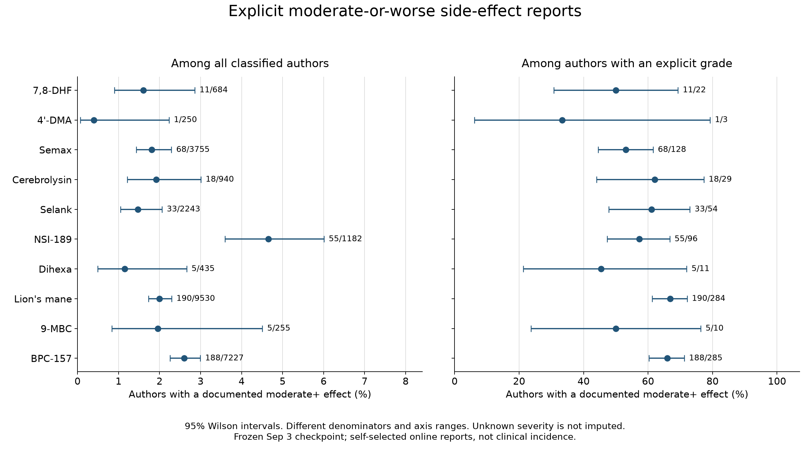
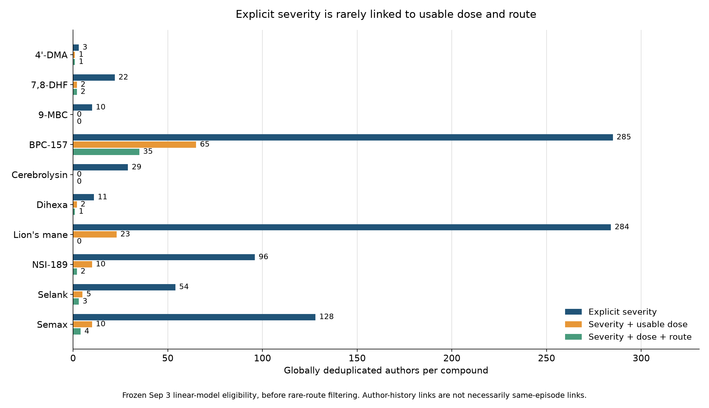
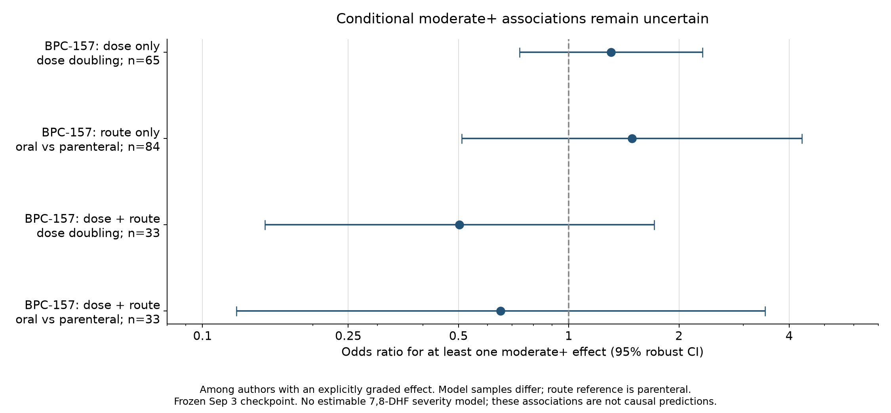

# Side-effect severity: the September 3 analysis checkpoint

This report makes the saved September 3, 2026 analysis reviewable. It re-renders validated aggregate outputs; it does not rerun extraction or refit the historical models. Some source files were finalized just after midnight UTC on September 4. The source hashes and recorded settings are in [the provenance manifest](severity_checkpoint_provenance.json). Later reconstructed model runs must be reported separately because they are not the original analysis code.

The [separate reconstruction report](severity_reconstruction.md) records the results of the newly implemented analysis. Its stricter exposure eligibility retains one jointly linked, graded 7,8-DHF author rather than the two recorded here. It uses saved dose values and does not independently re-audit their original text attribution. The historical figures below are preserved so that this implementation difference is visible.

## What the data can support

The study covers 19 independently processed communities and ten compounds. For 7,8-DHF, 684 classified authors reduce to 22 authors with an explicitly graded side effect, 2 graded authors with a usable dose, and 2 graded authors with both dose and route before rare-route exclusions. A large overall corpus therefore does not provide a sufficiently large sample for its severity regression. Cerebrolysin has 940 classified authors and 29 with an explicit grade, but no graded authors with both usable numeric mg dose and route in this checkpoint. A missing mg dose does not mean the original post contained no dosing information; volume-based preparations require separate treatment-specific handling.

The detailed severity outcome retains a distinct author-treatment-canonical side-effect observation and the maximum explicit grade for repeat mentions of that same effect. It keeps different effects from one author separate and clusters model uncertainty by author. Author-level maximum and average severity are secondary summaries. Mild=1, moderate=2, severe=3, and life-threatening=4. These are ordinal categories; the linear summaries assume equal spacing for convenience.

## Denominators and missingness

Every row below deduplicates an author across all communities for that compound. Authors can appear under more than one compound. Any side effect means a mapped report; a missing report is not evidence that a person experienced none. Severity is only extracted when explicitly graded. Unknown severity is never coded as mild or zero.

The abbreviated 4'-DMA label means 4'-DMA-7,8-DHF, which is kept separate from plain 7,8-DHF.

| Compound | Classified authors | Any mapped effect (95% CI) | Graded / effect-reporting authors (95% CI) | Moderate+ / all authors (95% CI) | Moderate+ / graded authors (95% CI) |
| --- | --- | --- | --- | --- | --- |
| 7,8-DHF | 684 | 275/684 (40.2%; 36.6% to 43.9%) | 22/275 (8.0%; 5.3% to 11.8%) | 11/684 (1.6%; 0.9% to 2.9%) | 11/22 (50.0%; 30.7% to 69.3%) |
| 4'-DMA | 250 | 92/250 (36.8%; 31.1% to 42.9%) | 3/92 (3.3%; 1.1% to 9.2%) | 1/250 (0.4%; 0.1% to 2.2%) | 1/3 (33.3%; 6.1% to 79.2%) |
| Semax | 3755 | 1277/3755 (34.0%; 32.5% to 35.5%) | 128/1277 (10.0%; 8.5% to 11.8%) | 68/3755 (1.8%; 1.4% to 2.3%) | 68/128 (53.1%; 44.5% to 61.6%) |
| Cerebrolysin | 940 | 299/940 (31.8%; 28.9% to 34.9%) | 29/299 (9.7%; 6.8% to 13.6%) | 18/940 (1.9%; 1.2% to 3.0%) | 18/29 (62.1%; 44.0% to 77.3%) |
| Selank | 2243 | 577/2243 (25.7%; 24.0% to 27.6%) | 54/577 (9.4%; 7.2% to 12.0%) | 33/2243 (1.5%; 1.0% to 2.1%) | 33/54 (61.1%; 47.8% to 73.0%) |
| NSI-189 | 1182 | 615/1182 (52.0%; 49.2% to 54.9%) | 96/615 (15.6%; 13.0% to 18.7%) | 55/1182 (4.7%; 3.6% to 6.0%) | 55/96 (57.3%; 47.3% to 66.7%) |
| Dihexa | 435 | 182/435 (41.8%; 37.3% to 46.5%) | 11/182 (6.0%; 3.4% to 10.5%) | 5/435 (1.1%; 0.5% to 2.7%) | 5/11 (45.5%; 21.3% to 72.0%) |
| Lion's mane | 9530 | 3660/9530 (38.4%; 37.4% to 39.4%) | 284/3660 (7.8%; 6.9% to 8.7%) | 190/9530 (2.0%; 1.7% to 2.3%) | 190/284 (66.9%; 61.2% to 72.1%) |
| 9-MBC | 255 | 119/255 (46.7%; 40.6% to 52.8%) | 10/119 (8.4%; 4.6% to 14.8%) | 5/255 (2.0%; 0.8% to 4.5%) | 5/10 (50.0%; 23.7% to 76.3%) |
| BPC-157 | 7227 | 2441/7227 (33.8%; 32.7% to 34.9%) | 285/2441 (11.7%; 10.5% to 13.0%) | 188/7227 (2.6%; 2.3% to 3.0%) | 188/285 (66.0%; 60.3% to 71.2%) |

All intervals in these proportion tables are two-sided 95% Wilson intervals. They describe author-level sampling uncertainty under a binomial model. They do not include extraction error, self-selection, or uncertainty about unreported outcomes. The all-author moderate+ rate is the fraction with a documented qualifying report in this corpus, not clinical incidence and not a lower bound on population incidence. The conditional rate describes the selected authors who supplied a severity grade.

## Why dose and route prediction remain limited

| Compound | Graded authors | With dose | With route | With both | Distinct graded effects | Graded effects with both |
| --- | --- | --- | --- | --- | --- | --- |
| 4'-DMA | 3 | 1 | 1 | 1 | 4 | 2 |
| 7,8-DHF | 22 | 2 | 4 | 2 | 27 | 3 |
| 9-MBC | 10 | 0 | 1 | 0 | 12 | 0 |
| BPC-157 | 285 | 65 | 87 | 35 | 335 | 39 |
| Cerebrolysin | 29 | 0 | 1 | 0 | 33 | 0 |
| Dihexa | 11 | 2 | 3 | 1 | 11 | 1 |
| Lion's mane | 284 | 23 | 0 | 0 | 312 | 0 |
| NSI-189 | 96 | 10 | 5 | 2 | 114 | 4 |
| Selank | 54 | 5 | 6 | 3 | 59 | 4 |
| Semax | 128 | 10 | 10 | 4 | 147 | 5 |

Dose, route, and joint counts in this table use the saved linear-model eligibility definition and are before sparse route levels are removed. The separately listed graded-effect counts use the fine-grained definition, which retains distinct effects. Their denominators must not be interchanged. The earlier severity feasibility report used a different, fixed dose-band rule and counted one jointly eligible 7,8-DHF author; the later model eligibility stage counted two. This is a definition change, not two conflicting estimates of the same sample.

These are author-history links: a person's dose, route, and outcome can have appeared in different posts. They are not guaranteed to describe the same exposure episode. The separate [same-post episode analysis](78dhf_episode_analysis.md) addresses episode linkage and has different denominators. Its episodes can repeat within authors, so a simple Wilson interval over episodes is descriptive and does not account for that dependence. Individual dose-route cells here are descriptive and cannot establish a causal dose or route effect.

## Moderate-or-worse side effects worth examining

Moderate+ includes moderate, severe, and life-threatening explicit grades. The following is the saved leading-effect subset, not an exhaustive effect inventory. An author may appear in several rows. A compound absent from this subset has no selected row, which is not evidence of zero moderate+ reports.

| Compound | Mapped side effect | Authors moderate+ | Moderate | Severe | Life-threatening |
| --- | --- | --- | --- | --- | --- |
| 7,8-DHF | depressed or flattened mood | 3 | 0 | 3 | 0 |
| 7,8-DHF | anxiety or panic | 2 | 0 | 2 | 0 |
| 7,8-DHF | cognitive or perceptual disturbance | 2 | 1 | 1 | 0 |
| 9-MBC | appetite change | 1 | 0 | 1 | 0 |
| 9-MBC | insomnia or sleep disruption | 1 | 0 | 1 | 0 |
| BPC-157 | anxiety or panic | 38 | 3 | 35 | 0 |
| BPC-157 | depressed or flattened mood | 32 | 2 | 30 | 0 |
| BPC-157 | fatigue or sedation | 18 | 5 | 13 | 0 |
| Cerebrolysin | insomnia or sleep disruption | 4 | 0 | 4 | 0 |
| Cerebrolysin | cognitive or perceptual disturbance | 3 | 1 | 2 | 0 |
| Cerebrolysin | activation or irritability | 1 | 0 | 1 | 0 |
| Dihexa | headache or migraine | 1 | 0 | 1 | 0 |
| Dihexa | insomnia or sleep disruption | 1 | 0 | 1 | 0 |
| Lion's mane | anxiety or panic | 40 | 3 | 37 | 0 |
| Lion's mane | insomnia or sleep disruption | 27 | 1 | 26 | 0 |
| Lion's mane | depressed or flattened mood | 16 | 1 | 15 | 0 |
| NSI-189 | anxiety or panic | 20 | 4 | 16 | 0 |
| NSI-189 | headache or migraine | 9 | 3 | 6 | 0 |
| NSI-189 | cognitive or perceptual disturbance | 6 | 0 | 6 | 0 |
| Selank | anxiety or panic | 6 | 0 | 6 | 0 |
| Selank | headache or migraine | 5 | 1 | 4 | 0 |
| Selank | insomnia or sleep disruption | 4 | 0 | 4 | 0 |
| Semax | insomnia or sleep disruption | 9 | 2 | 7 | 0 |
| Semax | anxiety or panic | 9 | 4 | 5 | 0 |
| Semax | depressed or flattened mood | 7 | 0 | 7 | 0 |

## Models: dose alone, route alone, and both together

The historical maximum-severity models use log2 dose, so a dose coefficient is the expected score-point difference per doubling. Route is categorical, with the reference in each term. Fine-grained models additionally distinguish any reported effect, distinct-effect count, and ordinal severity of an effect. Ratios have a null value of 1; linear score differences have a null value of 0. The joint model includes dose and route main effects. An interaction model asks the additional question of whether the dose association differs by route.

The frozen analysis contains no estimable 7,8-DHF severity model, including dose alone. BPC-157 supplied most of the joint severity sample. Its moderate+ models are conditional on having an explicitly graded effect:

| Compound | Model | Term | Graded authors | OR (95% CI) | p |
| --- | --- | --- | --- | --- | --- |
| BPC-157 | dose only | dose doubling | 65 | 1.31 (0.73 to 2.32) | 0.3637 |
| BPC-157 | route only | oral vs parenteral | 84 | 1.49 (0.51 to 4.34) | 0.4670 |
| BPC-157 | dose + route | dose doubling | 33 | 0.50 (0.15 to 1.71) | 0.2719 |
| BPC-157 | dose + route | oral vs parenteral | 33 | 0.65 (0.12 to 3.44) | 0.6142 |

The dose-only and joint models use different eligible samples, so their coefficients are not a controlled comparison of adjustment alone. All displayed conditional moderate+ confidence intervals include the null odds ratio of 1. They do not establish absence of an effect. Estimated means or probabilities, even where a model fits, are in-sample associations without demonstrated predictive performance on new participants.

Historical linear joint-model estimates and the secondary average-severity comparison are shown below. The complete dose-only, route-only, joint, interaction, sensitivity coefficients and non-estimable statuses are in the [model appendix](severity_checkpoint_models.md).

| Outcome | Scope / compound | Term | Authors | Score difference (95% CI) | p |
| --- | --- | --- | --- | --- | --- |
| maximum severity | BPC-157 | log2 dose (per doubling) | 33 | -0.29 (-0.71 to 0.13) | 0.1741 |
| maximum severity | BPC-157 | route: oral vs parenteral | 33 | -0.09 (-0.83 to 0.65) | 0.8036 |
| average severity | BPC-157 | log2 dose (per doubling) | 33 | -0.23 (-0.66 to 0.19) | 0.2716 |
| average severity | BPC-157 | route: oral vs parenteral | 33 | -0.06 (-0.82 to 0.70) | 0.8701 |
| maximum severity | all compounds | log2 dose (per doubling) | 40 | -0.26 (-0.67 to 0.16) | 0.2222 |
| maximum severity | all compounds | route: oral vs parenteral | 40 | -0.10 (-0.84 to 0.63) | 0.7798 |
| average severity | all compounds | log2 dose (per doubling) | 40 | -0.22 (-0.64 to 0.20) | 0.2949 |
| average severity | all compounds | route: oral vs parenteral | 40 | -0.07 (-0.82 to 0.68) | 0.8574 |

The source fine-grained report includes nominal pooled associations for occurrence and effect count. They should remain exploratory: several outcomes, treatments, and models were examined, the exposure links are across author history, and extreme-dose sensitivity changed some results. A fitted model or a small nominal p value is not evidence of clinical benefit or safety.

## Compound-specific exposure summaries

Dose cut points were derived separately for each treatment from dose-linked authors after the primary plausibility screen. Tied cut points are kept together and can collapse three intended groups into two. These are sample-derived descriptive bins, not clinical dose recommendations or equivalent potency across treatments. Dose uses a geometric mean only when the author's eligible numeric mg values remain in one band. Primary dose analyses exclude 7,8-DHF values at or above 100 mg; the separately audited historical high-dose episodes are described in the study README and episode report.

| Compound | First cut (mg) | Second cut (mg) |
| --- | --- | --- |
| 4'-DMA | 10 | 10 |
| 7,8-DHF | 20 | 25 |
| 9-MBC | 11.1217 | 15 |
| BPC-157 | 0.25 | 0.5 |
| Cerebrolysin | 5 | 5 |
| Dihexa | 10 | 17.5 |
| Lion's mane | 500 | 1000 |
| NSI-189 | 30 | 40 |
| Selank | 0.266 | 0.5 |
| Semax | 0.3 | 0.6 |

Regression groups oral mucosal and swallowed oral as oral, and nasal mucosal as nasal. The [exposure appendix](severity_checkpoint_exposures.md) preserves all saved dose-only, route-only, and dose-plus-route cells, including average and maximum severity and the recorded 95% bootstrap intervals. These groupings sacrifice formulation detail and do not equate absorption across routes.

Bootstrap intervals based on two or three authors can be unstable. If all observed scores are identical, the saved percentile interval can collapse to one value; this reflects the observed resample support, not certainty about the population. A missing interval is explicitly shown as not estimable. A linear prediction may also fall outside the 1-4 scale and should not be read as an actual severity category.

## Implication for the next study

The strongest contribution is identifying what to measure prospectively: exact compound and formulation, dose and schedule, route, reason for use, concurrent treatments, and each side effect's explicit severity and timing. An opt-in survey could improve completeness, but recall and selection bias would remain. The online reports are hypothesis-generating evidence. Compounds should not be ranked as safer from the conditional severity percentages alone.

The nootropic-adjacent communities and disease-focused communities were processed independently. Their identities and recorded database digests are retained in the provenance manifest. The combined results above do not establish that their respondents represent OMF's disease population.
