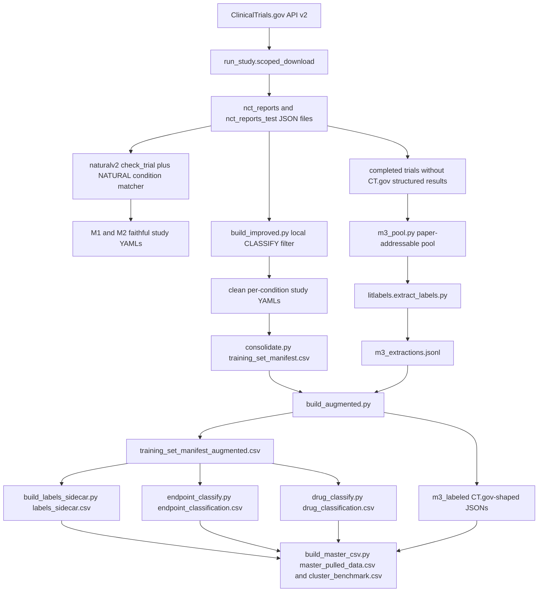
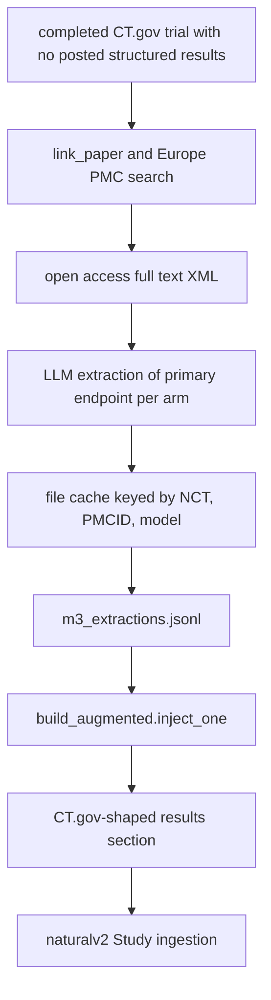
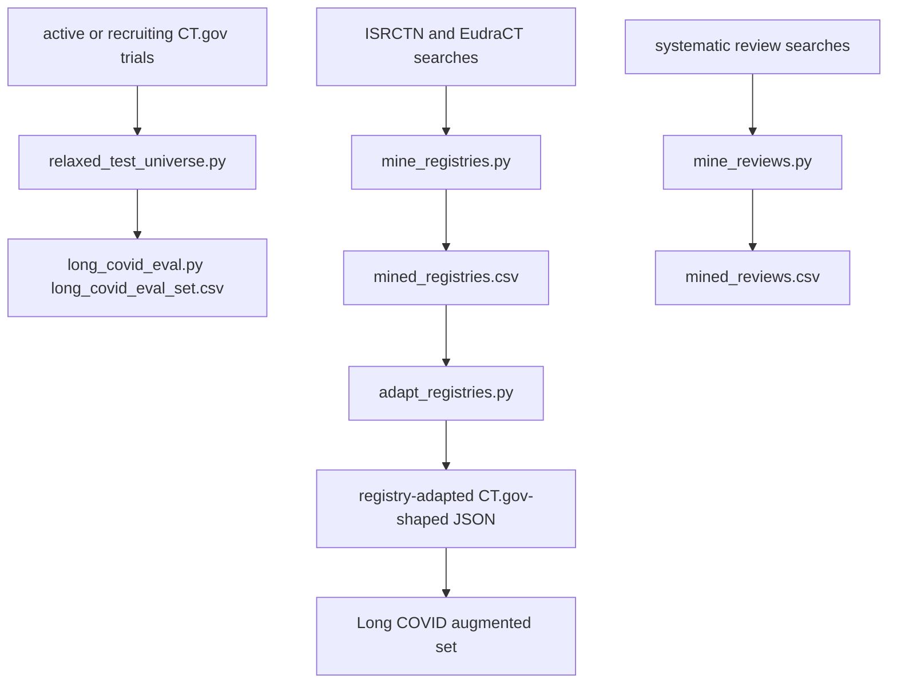

# Source Review Guide

This guide is for manually reviewing `trial_superset/` by hand. It focuses on whether the folder makes sense as a data-building pipeline for NATURAL, where the important logic lives, and what order to read the files in.

The short version: this code is script-oriented and artifact-oriented. The scientific logic is understandable, but many contracts are implicit in filenames under `data/`, so a good hand review should track each script's inputs, outputs, and filter assumptions.

## What To Review First

Start with the source and docs. Do not start with `.venv/`, `__pycache__/`, `.cache/`, or the thousands of trial JSON files under `data/`; those are dependencies, caches, or generated artifacts.

Use this order:

1. Read `README.md`, then `docs/method_and_scope.md`, then `docs/bugs.md`.
2. Read `seed_terms.py` and `config/create_study.yaml` to understand the condition universe and NATURAL toggles.
3. Read `run_study.py` and `verify_m1.py` to understand the faithful reproduction path.
4. Read `broaden.py`, `audit_conditions.py`, `build_improved.py`, and `consolidate.py` to understand the improved condition-filter path.
5. Read `m3_pool.py`, `litlabels/europe_pmc.py`, `litlabels/cache.py`, and `litlabels/extract_labels.py` to understand papers-as-labels.
6. Read `build_augmented.py`, `build_labels_sidecar.py`, `endpoint_classify.py`, `drug_classify.py`, and `build_master_csv.py` to understand exports.
7. Read `relaxed_test_universe.py`, `long_covid_eval.py`, `mine_registries.py`, `adapt_registries.py`, and `mine_reviews.py` for targets and additional sources.
8. Finish with `sanity_check.py`, `extract_validate.py`, and `binary_compare.py` for QA and sensitivity checks.

## Readability Sanity Check

The pipeline is coherent: it keeps a faithful NATURAL reproduction path separate from an improved Long COVID filter path, then adds paper-derived labels and registry-adapted labels as flagged augmentations. That separation is the most important thing to preserve when reviewing or editing the folder.

The main readability weakness is that scripts pass state through generated CSVs, JSONL files, and copied CT.gov-style JSON directories instead of through a small importable service layer. That is workable for a research pipeline, but reviewers should treat each artifact path as part of the contract.

The second readability weakness is that some scripts are important but intentionally not tracked with data, especially `build_master_csv.py` and `data/master_pulled_data.csv`. The README now calls this out, and this guide includes that script in the review order even though it is gitignored by this folder's `.gitignore`.

The code predates the stricter project conventions in `AGENTS.md`: it uses `argparse`, module-level string paths, and raw dicts in many places. I would not convert that in a readability pass unless the user wants a refactor, because the safer first step is to lock down artifact contracts and tests.

## Pipeline Diagrams

### Full Trial Superset Flow

### Two-Filter Logic

The first filter is a CT.gov search scope. It exists to stage a broad candidate pool cheaply, not to define the final scientific cohort. The second filter runs locally over downloaded JSON fields, so its behavior is inspectable and repeatable from the saved files.

### Paper Label Flow

### Additional Sources And Targets

## Manual Review Checklist

For every script, write down five things before judging it:

1. Inputs: which data files, JSON directories, environment variables, APIs, or sibling modules it reads.
2. Outputs: which CSV, JSONL, YAML, or copied trial JSON artifacts it writes.
3. Selection logic: condition filters, status filters, trial design filters, placebo filters, date filters, and label-source filters.
4. NATURAL boundary: whether it is calling pinned `naturalv2` logic unchanged or deliberately deviating from it.
5. Failure mode: what happens if an API fails, a file is absent, an extraction is missing, or a trial has an unusual arm or endpoint shape.

Pay special attention to the distinction between:

- `data/m1_outputs/`: faithful Long COVID reproduction of Nikita's shared setup.
- `data/m2_outputs/`: faithful mode extended across the five-condition cluster.
- `data/improved_outputs/`: local classifier mode, deliberately different from the faithful matcher.
- `data/m3_labeled/`: augmented set after paper and registry labels are injected.
- `data/relaxed_test/`: recruiting-inclusive test universe used to recover prospective targets like LIFT.

## Bug-Specific Review Pointers

The two NATURAL bugs most likely to matter downstream are not fixed inside this folder, because this folder depends on pinned `naturalv2`. The local code documents and works around them where possible.

For continuous labels, review `docs/label_normalization.md`, then `build_labels_sidecar.py`, then `build_master_csv.py`. The sidecar preserves raw values, denominators, endpoint type, change-from-baseline flags, and scale proportions so continuous means are not treated as `mean / N`.

For placebo-arm dropping, review `docs/long_covid_focus.md`, then `long_covid_eval.py`, then `build_labels_sidecar.py`. The problem is that arm names containing placebo can still be experimental arms in factorial designs, so a string-only placebo filter can remove valid arms.

For condition matching, review `docs/condition_filter_audit.md`, `seed_terms.py`, `run_study.py`, and `build_improved.py`. The key point is that CT.gov search scope and local condition classification are different layers.

## Appendix: File Notes

### Top-Level Files

| File | Notes |
|---|---|
| `.gitignore` | Ignores `data/`, caches, bytecode, `.venv/`, `build_master_csv.py`, and `master_pulled_data.csv`. That means important runtime artifacts and one important export script may exist locally without being tracked by git. |
| `README.md` | Main orientation document for the whole folder. It explains provenance, the two dataset outputs, the faithful vs improved modes, and the major NATURAL bugs. |
| `requirements.txt` | Pins `naturalv2` to commit `16ca17819e7b6310f9d9799238f4ff8b11b4c6f5` and requires `httpx`. Treat that pin as part of the scientific contract, because changing it can alter NATURAL's filters and YAML schema. |

### Config Files

| File | Notes |
|---|---|
| `config/common.yaml` | Minimal Hydra-style defaults that mirror NATURAL settings such as seed, train ratio, save path, and default condition. This file is more provenance than orchestration, because most scripts build configs directly in Python. |
| `config/create_study.yaml` | Holds the NATURAL trial-filter preset used by the study creation path. It sets randomized, parallel, nonhealthy, and binary-endpoint flags, so review it alongside `run_study.DEFAULTS`. |

### Core Pipeline Scripts

| File | Notes |
|---|---|
| `seed_terms.py` | Single source of truth for the five-condition cluster, CT.gov scope queries, local improved classifier tokens, and candidate-drug aliases. This is the first code file to review because many downstream counts depend on these constants. |
| `run_study.py` | Reproduces Nikita's NATURAL study creation path by pre-staging a scoped CT.gov JSON pool, then calling `naturalv2.cli.create_study.run_study_and_get_stats`. The key readability point is that scoped download is only a broad candidate pool; NATURAL's own filters still do selection in faithful mode. |
| `verify_m1.py` | Regression check for the faithful M1 reproduction. It verifies that the reproduced Long COVID study YAML loads into NATURAL and explains the known test-set gap caused by active-status filtering. |
| `broaden.py` | Runs the faithful NATURAL process across all five cluster conditions. It uses `seed_terms.CLUSTER` to supply condition strings and CT.gov scope queries, then samples trials for manual inspection. |
| `audit_conditions.py` | Compares NATURAL's substring matcher with the local improved classifier and records wins, losses, and noise by condition. Use it to understand why the Long COVID filter changed from broad COVID matching to explicit Long COVID terms. |
| `build_improved.py` | Builds canonical per-condition studies using the local `CLASSIFY` tokens instead of NATURAL's substring matcher. It is the main deliberate deviation from the faithful pipeline. |
| `consolidate.py` | Flattens improved study YAMLs into `data/training_set_manifest.csv`. Review this as the bridge between per-condition NATURAL YAML files and the later CSV-based export pipeline. |
| `build_augmented.py` | Injects paper-extracted and registry-adapted labels into CT.gov-shaped trial JSONs, then creates the augmented manifest. This is a high-risk file because it synthesizes results sections that NATURAL will later parse as if they came from structured results. |
| `build_labels_sidecar.py` | Creates per-trial, per-outcome, per-arm label rows with endpoint type, raw value, denominator, scale proportion, and change-from-baseline flags. This is the local workaround for NATURAL's continuous-label normalization problem. |
| `build_master_csv.py` | Joins the augmented manifest, sidecar labels, paper extractions, endpoint classifications, drug classifications, and trial JSON metadata into the final master CSVs. It is intentionally gitignored in this folder, but it is essential for understanding `master_pulled_data.csv` and `cluster_benchmark.csv`. |

### Classification And Evaluation Scripts

| File | Notes |
|---|---|
| `endpoint_classify.py` | Uses the LLM client to classify endpoint text into domain, modality, self-reportability, instrument, and match-to-test fields. Review its prompt, cache behavior, and CSV schema before trusting endpoint-derived flags. |
| `drug_classify.py` | Uses the LLM client to classify interventions by drug class and accessibility. It feeds downstream self-experimentability and candidate-drug flags in the master export. |
| `long_covid_eval.py` | Persists the recruiting-inclusive Long COVID evaluation set and handles relabeling around LIFT's factorial arms. Review it when checking whether prospective targets actually satisfy NATURAL's assumptions. |
| `relaxed_test_universe.py` | Builds a test universe that includes recruiting trials NATURAL's pinned `status:act` query can miss. This is a targeted compatibility layer for prospective Long COVID targets, not a replacement for the completed-trial benchmark. |

### Additional-Source Scripts

| File | Notes |
|---|---|
| `mine_registries.py` | Mines non-CT.gov registries, especially ISRCTN and EudraCT-adjacent records, for candidate Long COVID RCTs. Its output is an exploratory CSV and does not itself make trials NATURAL-ready. |
| `adapt_registries.py` | Converts selected non-CT.gov registry records into CT.gov-shaped trial JSONs using templates plus paper-derived outcomes. Review this carefully because it crosses the CT.gov-only boundary and must keep provenance flags intact. |
| `mine_reviews.py` | Mines systematic review evidence tables for trial leads and possible labels. Its output is candidate evidence, not a validated ingestion path. |

### QA And Sensitivity Scripts

| File | Notes |
|---|---|
| `m3_pool.py` | Quantifies the pool of completed no-results trials that might be rescued by paper labels. It is the gate before spending LLM calls on extraction. |
| `relink_long_covid.py` | Retries Long COVID paper linking with multiple candidate papers for trials that were declined or missed initially. Review it as a recovery tool, not as the primary extraction workflow. |
| `extract_validate.py` | Compares paper-extracted primary outcome values against CT.gov structured-result ground truth for trials that have both. This is the main empirical check on whether paper-derived labels are trustworthy enough to use. |
| `binary_compare.py` | Measures how much data would survive under NATURAL's binary endpoint preset compared with the notbinary path. It justifies retaining continuous endpoints and using the sidecar. |
| `sanity_check.py` | Runs broad QA checks on the augmented dataset, including split disjointness, baseline preservation, and label range sanity. Run it after changing artifact-producing scripts. |

### `litlabels/` Package

| File | Notes |
|---|---|
| `litlabels/__init__.py` | Empty package marker so the extraction helpers can be imported with `PYTHONPATH=trial_superset`. There is no business logic here. |
| `litlabels/cache.py` | Small file-cache helper keyed by request content and TTL. It is important because Europe PMC calls and LLM extraction are slow and should be reproducible without repeated network calls. |
| `litlabels/europe_pmc.py` | Europe PMC client wrapper for search and full-text retrieval. Review retry behavior, timeout assumptions, and how IDs are passed into extraction. |
| `litlabels/extract_labels.py` | Links papers, pulls open access full text, extracts relevant text, prompts the LLM, parses JSON, and writes extraction records. This is the highest-risk LLM path, so review prompt shape, caching, confidence handling, and failure behavior together. |

### Documentation Files

| File | Notes |
|---|---|
| `docs/method_and_scope.md` | Explains the core scientific framing: NATURAL estimates each trial independently and this folder builds a benchmark plus target list, not a pooled training set. Read this before interpreting counts. |
| `docs/bugs.md` | Consolidated bug registry for issues found in pinned NATURAL and in this local effort. This is the best starting point when writing reports for Nikita. |
| `docs/condition_filter_audit.md` | Detailed evidence for condition-matcher overmatching and undermatching. It explains why Long COVID needed a local text filter rather than relying only on CT.gov query behavior. |
| `docs/test_universe_status.md` | Describes the `status:act` issue and why recruiting trials such as LIFT can be absent from the pinned NATURAL test universe. Use it when reviewing prospective target coverage. |
| `docs/label_normalization.md` | Explains the continuous-label problem in which NATURAL's notbinary path can divide means or scores by arm size. It also documents the sidecar export strategy. |
| `docs/validation.md` | Summarizes downstream compatibility, extraction accuracy, label flags, and validation limits. Read it after `extract_validate.py` and `sanity_check.py`. |
| `docs/long_covid_focus.md` | Focused Long COVID summary covering the benchmark, prospective targets, and factorial-arm bug. It is the most relevant doc for deciding which Long COVID trials satisfy NATURAL's assumptions. |
| `docs/additional_sources.md` | Explains registry and systematic-review mining as growth paths beyond CT.gov structured results. It is explicit about what was explored versus what was fully ingested. |
| `docs/long_covid_structured_21_trials.md` | Documents the clean 21-trial structured Long COVID set, the exact filters, counts, NATURAL assumption flags, and preserved columns. Use it for the narrow CT.gov structured-results subset. |
| `docs/nikita_handoff_explainer.md` | Narrative handoff covering bugs, what was pulled, how it was pulled, and what each CSV contains. This is written for external communication rather than code navigation. |
| `docs/source_review_guide.md` | This guide. It is the file to use when assigning a manual code review or walking someone through the folder. |

### Generated Data Artifacts

`data/` is intentionally not tracked by git, but the pipeline expects it to exist locally or be restored from S3. Review representative rows and schemas rather than every generated file.

Key files to inspect by hand are `training_set_manifest.csv`, `training_set_manifest_augmented.csv`, `labels_sidecar.csv`, `endpoint_classification.csv`, `drug_classification.csv`, `long_covid_eval_set.csv`, `master_pulled_data.csv`, and `cluster_benchmark.csv`. Key directories are `m1_outputs/`, `m2_outputs/`, `improved_outputs/`, `m3_labeled/`, and `relaxed_test/`.
