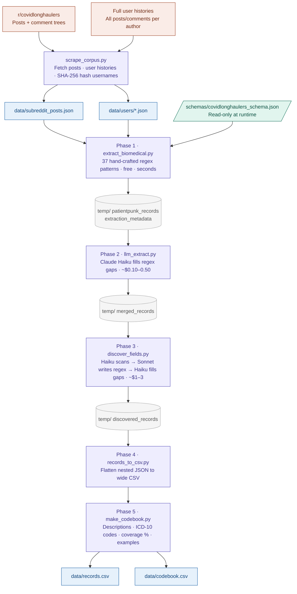

# PatientPunk — Variable Extraction

Structured biomedical data extraction from patient-authored Reddit text.

Reads a corpus produced by `scrape_corpus.py` (subreddit posts + per-user
history files) and extracts demographic and clinical fields (age, sex/gender,
conditions, medications, treatment outcomes, etc.) using a combination of
hand-crafted regex patterns and Claude Haiku/Sonnet LLM calls.

---

## Table of Contents

1. [Quick Start](#quick-start)
2. [Two Extraction Approaches](#two-extraction-approaches)
3. [Pipeline Phases](#pipeline-phases)
4. [Pipeline Architecture](#pipeline-architecture)
5. [CLI Reference](#cli-reference)
6. [Library Reference](#library-reference)
7. [Outputs](#outputs)
8. [Environment Setup](#environment-setup)
9. [Running Tests](#running-tests)
10. [Join Key](#join-key)
11. [Developer Guide](#developer-guide)

---

## Quick Start

```bash
# 1. Install dependencies
pip install anthropic python-dotenv

# 2. Add your Anthropic API key to the project root .env
cp ../.env.example ../.env && echo "ANTHROPIC_API_KEY=sk-ant-..." >> ../.env

# 3. Full pipeline run (regex + LLM gap-fill + CSV + codebook)
python main.py run --schema schemas/covidlonghaulers_schema.json

# 4. LLM-only demographics (age / sex / location, deductive + inductive)
python main.py demographics --input-dir ../data

# 5. Inspect the schema without running anything
python main.py inspect --schema schemas/covidlonghaulers_schema.json
```

---

## Two Extraction Approaches

Two distinct pipelines. They are complementary — both output records tagged
with `author_hash` as the join key, and can be run in either order.

### Approach A — Full Pipeline (regex + LLM)

Extracts **all 37+ fields** defined in the schema (age, sex/gender, conditions,
medications, procedures, functional status, etc.).

- **Phase 1** — regex patterns match known signals instantly and for free.
- **Phase 2** — Claude Haiku extracts fields that regex missed (default).
- **Phase 3** — (opt-in) discovers *new* fields not yet in the schema.

```bash
# Default: Phases 1-2-4-5 (no discovery)
python main.py run --schema schemas/covidlonghaulers_schema.json

# With discovery (auto-merge all candidates)
python main.py run --schema schemas/covidlonghaulers_schema.json --discover auto

# With discovery (stop for human review in Marimo variable picker)
python main.py run --schema schemas/covidlonghaulers_schema.json --discover review
```

### Approach B — LLM-Only Demographics

Extracts demographic fields only — no regex. Haiku is given a strict
self-reference constraint: it only extracts values the author states explicitly
about themselves. Works especially well with full user posting histories
(typically 4–5× more coverage than single posts).

Supports two complementary coding modes:

| Mode | What it does |
|---|---|
| `deductive` | Extracts predefined fields: `age`, `sex_gender`, `location_country`, `location_state` |
| `inductive` | Discovers NEW demographic categories from the data: occupation, insurance type, ethnicity, etc. |
| `both` (default) | Deductive + inductive in a single LLM pass |

```bash
# Both deductive + inductive (default)
python main.py demographics --input-dir ../data

# Deductive only
python main.py demographics --input-dir ../data --mode deductive

# Inductive only (discover new categories)
python main.py demographics --input-dir ../data --mode inductive

# User histories only (recommended — best coverage)
python main.py demographics --input-dir ../data --users-only
```

---

## Pipeline Phases

| Phase | Script | Class | Cost | Description |
|-------|--------|-------|------|-------------|
| 1 | `extract_biomedical.py` | `BiomedicalExtractor` | Free | Regex patterns across all schema fields |
| 2 | `llm_extract.py` | `LLMExtractor` | ~$0.05-0.10 | Claude Haiku extracts fields regex missed |
| 3 | `discover_fields.py` | `FieldDiscoveryExtractor` | ~$1-3 | Haiku discovers new fields; Sonnet writes regex (opt-in) |
| 4 | `records_to_csv.py` | `CSVExporter` | Free | Flatten JSON records to `records.csv` |
| 5 | `make_codebook.py` | `CodebookGenerator` | Free | Generate `codebook.csv` data dictionary |

```bash
# Default run (Phases 1-2-4-5, discovery off)
python main.py run --schema schemas/...

# Regex only -- no API key needed
python main.py run --schema schemas/... --no-llm

# With discovery (auto-merge)
python main.py run --schema schemas/... --discover auto

# With discovery (human review via Marimo)
python main.py run --schema schemas/... --discover review
```

### Cost estimates (220-post corpus)

| Phase | Model | Cost |
|---|---|---|
| 1 — Regex | none | Free |
| 2 — LLM gap-fill | Haiku | ~$0.10–0.50 |
| 3 — Discovery | Haiku + Sonnet | ~$1–3 |
| 4–5 — Export | none | Free |

Use `--limit 10` for a cheap test run before committing to the full corpus.

### Intermediate files

All intermediate JSON is written to `data/temp/` and wiped at the start of each full run.

```
data/
├── records.csv
├── codebook.csv
└── temp/
    ├── patientpunk_records_{schema_id}.json
    ├── extraction_metadata_{schema_id}.json
    ├── llm_records_{schema_id}.json
    ├── merged_records_{schema_id}.json
    ├── phase1_candidates.json
    ├── discovered_records_{schema_id}.json
    └── discovered_field_report_{schema_id}.json
```

---

## Pipeline Architecture



### What Phase 1 extracts (regex)

| Category | Fields |
|---|---|
| Demographics | Age, sex/gender, location (country + US state), occupation, ethnicity, BMI |
| Conditions | 60+ named conditions, time to diagnosis, misdiagnosis, diagnosis source |
| Symptom history | Age at onset, trigger, duration, trajectory |
| Genetics | Family history, genetic testing |
| Treatments | 80+ medications, dosage, outcomes, procedures, dietary and alternative interventions |
| Functional status | Work/disability status, activity level, mental health, social impact |
| Healthcare experience | Doctor dismissal, diagnostic odyssey, costs, system access |
| Exposures | Toxic/environmental, trauma, hormonal events, prior infections |

### What Phase 2 catches that regex cannot

- **Paraphrased mentions** — "my heart races when I stand" → POTS
- **Negation** — "I don't have POTS" correctly excluded
- **Treatment-outcome pairs** — "LDN helped my brain fog but worsened sleep"
- **Temporal context** — "I had fatigue but it resolved" → past symptom, not current

### How Phase 3 discovery works

1. **Haiku** scans corpus for new field candidates with example snippets
2. **Sonnet** writes regex patterns, tests against examples, iterates up to 3 times
3. Validated regex runs across the full corpus (free)
4. **Haiku** fills gaps where regex missed

Fields accepted at ≥ 50% hit rate. All auto-discovered fields carry `source: "llm_discovered"`.

---

## CLI Reference

### `run` — full pipeline

```
python main.py run --schema schemas/covidlonghaulers_schema.json [options]

  --input-dir PATH      Corpus directory (default: ../data)
  --temp-dir PATH       Intermediate files (default: {input-dir}/temp/)
  --start-at N          Resume from phase N (1–5)
  --no-llm              Skip Phase 2
  --discover MODE       Enable Phase 3: 'auto' (merge all) or 'review' (stop for human selection)
  --no-clean            Don't wipe temp/ before starting
  --workers N           Concurrent API workers (default: 10)
  --limit N             Process at most N records (cost control)
  --resume              Resume an interrupted run
  --skip-threshold F    LLM skips records where regex hit ≥ F fields (default: 0.7)
  --candidates PATH     Saved phase1_candidates.json (skips Phase 3 Stage 1)
  --sample N            Random N-item sample for Phase 3 Stage 1
  --no-fill             Skip Phase 3 Stage 4 gap-filling
  --sep STR             Multi-value separator in CSV (default: " | ")
  --provenance          Add {field}__provenance and {field}__confidence columns
  --codebook-format     csv (default) or markdown
  --no-discovered       Exclude llm_discovered fields from codebook
```

### `demographics` — LLM-only demographics

```
python main.py demographics --input-dir ../data [options]

  --mode                deductive | inductive | both (default: both)
  --input-dir PATH      Corpus directory
  --output-dir PATH     Output directory (default: same as --input-dir)
  --workers N           Concurrent Haiku workers (default: 10)
  --posts-only          Only process subreddit_posts.json
  --users-only          Only process users/*.json histories
  --max-chars N         Max characters per record sent to LLM (default: 8000)
```

### `inspect` — schema introspection

```
python main.py inspect --schema schemas/covidlonghaulers_schema.json [options]

  --source STR          Filter by: base | base_optional | extension | llm_discovered
  --verbose             Show regex patterns for each field
```

### `corpus` — corpus statistics

```
python main.py corpus --input-dir ../data
# Prints: post count, user history count, total records
```

### `export` — re-run export only (Phases 4 + 5)

```
python main.py export --schema schemas/covidlonghaulers_schema.json [options]
# Re-generates records.csv and codebook.csv from existing temp/ files
```

---

## Library Reference

The `patientpunk` package can be imported directly for use in notebooks or scripts.

```python
from patientpunk import CorpusLoader, Pipeline, PipelineConfig, DemographicCoder
from pathlib import Path

# Load corpus
loader = CorpusLoader(Path("../data"))
print(loader.post_count, loader.user_count)

# Full pipeline
config = PipelineConfig(
    schema_path=Path("schemas/covidlonghaulers_schema.json"),
    input_dir=Path("../data"),
    run_llm=True,
    discovery_mode=None,  # "auto" or "review" to enable
    limit=50,
)
result = Pipeline(config).run()
print(result.ok, result.summary())

# LLM-only demographics (deductive + inductive)
coder = DemographicCoder(
    input_dir=Path("../data"),
    mode="both",
    include_users=True,
)
coder.run()
```

---

## Outputs

### `data/records.csv`

One row per user / subreddit post. Multi-value fields joined with `" | "`.

Key columns:
- `author_hash` — SHA-256 of the Reddit username (join key with Polina's pipeline)
- `source_type` — `subreddit_post` or `user_history`
- One column per schema field (`age`, `sex_gender`, `conditions`, ...)
- With `--provenance`: additional `{field}__confidence` and `{field}__provenance` columns

### `data/codebook.csv`

One row per field: field name, source, description, confidence tier, ICD-10 code,
observed coverage %, example values.

### `data/demographics_deductive.csv` (LLM-only, deductive)

Columns: `author_hash`, `source_type`, `age`, `sex_gender`, `location_country`,
`location_state`, `confidence`, `evidence`.

### `data/demographics_inductive.json` + `demographics_codebook.json` (LLM-only, inductive)

Per-record discovered categories and aggregated frequency codebook.

---

## Environment Setup

```bash
pip install anthropic python-dotenv

# API key lives at the project root — shared by both pipelines
cp ../.env.example ../.env
# Edit ../.env: ANTHROPIC_API_KEY=sk-ant-...
```

Phase 1 (regex) and Phases 4–5 (export) require no API key.

---

## Running Tests

```bash
cd variable_extraction
python -m pytest tests/ -v
```

Comprehensive pytest suite (138 tests) with no live API calls. Covers corpus
loading, schema parsing, extractor argument construction, pipeline config
validation, qualitative standards injection, and codebook aggregation logic.

---

## Join Key

`author_hash` is a **SHA-256 hash of the Reddit username** — the join key between
Shaun's extraction pipeline (this module) and Polina's drug sentiment pipeline.

---

## Developer Guide

### File structure

```
variable_extraction/
├── main.py                        Entry point — CLI with 5 subcommands
├── README.md                      This file
├── conftest.py                    Tells pytest to skip old/ and scripts/
├── pytest.ini
├── .env                           API keys (gitignored)
│
├── schemas/
│   ├── base_schema.json           23 universal biomedical fields
│   └── covidlonghaulers_schema.json  COVID-specific extension fields
│
├── patientpunk/                   Importable Python library
│   ├── __init__.py                Public API surface
│   ├── py.typed                   PEP 561 marker
│   ├── corpus.py                  CorpusLoader + CorpusRecord
│   ├── schema.py                  Schema + FieldDefinition
│   ├── pipeline.py                Pipeline + PipelineConfig
│   ├── qualitative_standards.py   LLM coding standards (injected into prompts)
│   ├── _utils.py                  Internal helpers
│   ├── extractors/                Phase 1–3 wrappers + demographics
│   └── exporters/                 Phase 4–5 wrappers
│
├── scripts/                       Active canonical scripts (called by patientpunk/)
│   ├── extract_biomedical.py      Phase 1
│   ├── llm_extract.py             Phase 2
│   ├── discover_fields.py         Phase 3
│   ├── records_to_csv.py          Phase 4
│   ├── make_codebook.py           Phase 5
│   ├── extract_demographics_llm.py  Standalone demographics (deductive)
│   └── code_demographics_llm.py   Standalone demographics (deductive + inductive)
│
├── old/                           Deprecated reference copies — do not use
│   └── DEPRECATED.md
│
└── tests/
    ├── test_patientpunk.py
    └── test_pipeline.py
```

### Data model — PatientPunk v2.0 record

Every record written to `data/temp/patientpunk_records_*.json`:

```json
{
  "_patientpunk_version": "2.0",
  "_schema_id": "covidlonghaulers_v1",
  "_extracted_at": "2026-04-05T12:00:00+00:00",
  "record_meta": {
    "author_hash": "a3f8c2...",
    "source": "user_history",
    "text_count": 412,
    "post_id": null
  },
  "base": {
    "conditions": {
      "values": ["long covid", "pots"],
      "icd10_candidates": {"long covid": "U09.9", "pots": "G90.3"},
      "provenance": "self_reported",
      "confidence": "high"
    },
    "age": { "values": ["34"], "provenance": "self_reported", "confidence": "medium" }
  },
  "extension": {
    "vaccination_status": { "values": ["fully vaccinated"], "provenance": "self_reported", "confidence": "medium" }
  }
}
```

Every field object: `values` (list or null), `icd10_candidates` (conditions only),
`provenance` (`"self_reported"` | `"mentioned_by_other"` | null),
`confidence` (`"high"` | `"medium"` | `"low"` | null).

### Two-layer schema system

**Base fields** (always extracted): 23 universal fields in `BASE_FIELDS` covering
demographics, conditions, treatments, functional status, and healthcare experience.

**Base-optional fields**: 12 additional fields available via `include_base_fields`
in a schema (off by default — noisier or study-specific):
`location_us_state`, `ethnicity`, `occupation`, `bmi_weight`, `dosage`,
`dietary_interventions`, `alternative_treatments`, `genetic_testing`,
`social_impact`, `trauma_history`, `toxic_exposures`, `healthcare_costs`

**Extension fields**: new fields defined entirely in the schema's `extension_fields`
block with custom regex patterns.

### Writing an extension schema

Create a `.json` file in `schemas/`. It will be validated at startup.

```json
{
  "schema_id": "my_study_v1",
  "include_base_fields": ["dosage", "location_us_state"],
  "override_base_patterns": {
    "conditions": {
      "mode": "append",
      "patterns": ["\\b(my disease|variant name)\\b"]
    }
  },
  "extension_fields": {
    "my_new_field": {
      "description": "What this captures",
      "confidence": "medium",
      "patterns": ["\\b(pattern one|pattern two)\\b"]
    }
  }
}
```

Test patterns before a full run:

```bash
python scripts/extract_biomedical.py \
    --text "your test sentence" \
    --schema schemas/my_schema.json
```

### Adding or modifying regex patterns

Base patterns live in the `PATTERNS` dict in `scripts/extract_biomedical.py`.

```python
# Append a pattern to an existing field
"medications": [
    re.compile(r"\b(existing|patterns)\b", re.I),
    re.compile(r"\b(your new drug)\b", re.I),  # add here
],
```

All patterns use `re.IGNORECASE`. Double-escape backslashes in JSON (`\\b`).
Use captured groups — the extractor uses `m.group(1)` when present.

### Running the test suite

```bash
python -m pytest tests/ -v                          # full suite
python scripts/extract_biomedical.py --text "34F with POTS and long COVID"  # spot-check
```
