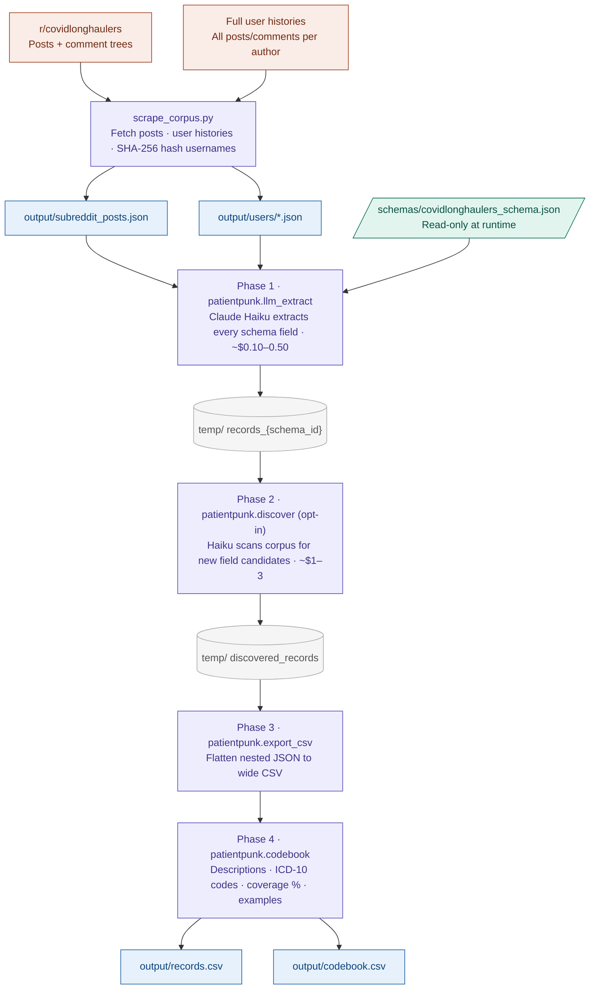

# PatientPunk — Variable Extraction

Structured biomedical data extraction from patient-authored Reddit text.

Reads a corpus produced by `scrape_corpus.py` (subreddit posts + per-user
history files) and extracts demographic and clinical fields (age, sex/gender,
conditions, medications, treatment outcomes, etc.) using Claude Haiku LLM calls.

> **Interpreting the output?** See [`METHODS.md`](./METHODS.md) for the self/other
> attribution model, known biases (and their tunable guards), and which fields to trust.

---

## Table of Contents

1. [Quick Start](#quick-start)
2. [Two Extraction Approaches](#two-extraction-approaches)
3. [Pipeline Phases](#pipeline-phases)
4. [Pipeline Architecture](#pipeline-architecture)
5. [CLI Reference](#cli-reference)
6. [Library Reference](#library-reference)
7. [Outputs](#outputs)
8. [Environment Setup](#environment-setup)
9. [Running Tests](#running-tests)
10. [Join Key](#join-key)
11. [Developer Guide](#developer-guide)

---

## Quick Start

```bash
# 1. Install dependencies (from the repo root)
uv sync

# 2. Add your Anthropic API key to the project root .env
cp ../.env.example ../.env && echo "ANTHROPIC_API_KEY=sk-ant-..." >> ../.env

# 3. Full pipeline run (LLM extraction + CSV + codebook)
#    NOTE: raw post extraction uses each post's title + body ONLY (a post record
#    belongs to the post author). For comment-heavy / subreddit corpora, run
#    `python main.py aggregate ...` first so commenters are captured as their own
#    patients -- otherwise comment-only evidence is intentionally skipped.
python main.py run --schema schemas/covidlonghaulers_schema.json

# 4. LLM-only demographics (age / sex / location, deductive + inductive)
python main.py demographics --input-dir ../output

# 5. Inspect the schema without running anything
python main.py inspect --schema schemas/covidlonghaulers_schema.json
```

---

## Two Extraction Approaches

Two distinct pipelines. They are complementary — both output records tagged
with `author_hash` as the join key, and can be run in either order.

### Approach A — Full Pipeline (LLM extraction)

Extracts **every field** defined in the schema (age, sex/gender, conditions,
medications, procedures, functional status, etc. — 28 fields for
`covidlonghaulers_schema.json`: 25 universal base fields plus 3 COVID-specific
extension fields).

- **Phase 1** — Claude Haiku extracts every field defined in the schema (default).
- **Phase 2** — (opt-in) discovers *new* fields not yet in the schema.

```bash
# Default: Phases 1-3-4 (no discovery)
python main.py run --schema schemas/covidlonghaulers_schema.json

# With discovery (auto-merge all candidates)
python main.py run --schema schemas/covidlonghaulers_schema.json --discover auto

# With discovery (stop for human review in Marimo variable picker)
python main.py run --schema schemas/covidlonghaulers_schema.json --discover review
```

### Approach B — LLM-Only Demographics

Extracts demographic fields only. Haiku is given a strict
self-reference constraint: it only extracts values the author states explicitly
about themselves. Works especially well with full user posting histories
(typically 4–5× more coverage than single posts).

Supports two complementary coding modes:

| Mode | What it does |
|---|---|
| `deductive` | Extracts predefined fields: `age`, `sex_gender`, `location_country`, `location_state` |
| `inductive` | Discovers NEW demographic categories from the data: occupation, insurance type, ethnicity, etc. |
| `both` (default) | Deductive + inductive in a single LLM pass |

```bash
# Both deductive + inductive (default)
python main.py demographics --input-dir ../output

# Deductive only
python main.py demographics --input-dir ../output --mode deductive

# Inductive only (discover new categories)
python main.py demographics --input-dir ../output --mode inductive

# User histories only (recommended — best coverage)
python main.py demographics --input-dir ../output --users-only
```

---

## Pipeline Phases

| Phase | Module | `run_*` | Cost | Description |
|-------|--------|---------|------|-------------|
| 1 | `llm_extract` | `run_llm_extract` | ~$0.05-0.10 | Claude Haiku extracts every schema field (default) |
| 2 | `discover` | `run_discovery` | ~$1-3 | Haiku discovers new fields not yet in the schema (opt-in) |
| 3 | `export_csv` | `run_export_csv` | Free | Flatten JSON records to `records.csv` |
| 4 | `codebook` | `run_codebook` | Free | Generate `codebook.csv` data dictionary |

```bash
# Default run (Phases 1-3-4, discovery off)
python main.py run --schema schemas/...

# Skip LLM extraction entirely (only useful with --start-at / resuming export)
python main.py run --schema schemas/... --no-llm

# With discovery (auto-merge)
python main.py run --schema schemas/... --discover auto

# With discovery (human review via Marimo)
python main.py run --schema schemas/... --discover review
```

### Resuming and re-exporting

`--start-at` uses the current four-phase pipeline:

| Command | Effect |
|---|---|
| `--start-at 3 --no-llm --no-clean` | Rebuild `records.csv` from existing `temp/records_{schema_id}.json`, then regenerate the codebook. |
| `--start-at 4 --no-llm --no-clean` | Regenerate only the codebook from the existing `records.csv`; it does not rewrite CSV output. |
| `python main.py export --schema schemas/...` | Re-run both export phases (CSV, then codebook) from existing intermediate records. |

CSV output begins with metadata columns: `author_hash`, `source`, `post_id`,
`text_count`, `schema_id`, `extraction_method`, and `extracted_at`. It then
contains one column per extracted field and, when requested from the module API,
per-field confidence columns. Per-field provenance columns are intentionally
absent because every extracted value now uses the LLM extraction path.

### Cost estimates (220-post corpus)

| Phase | Model | Cost |
|---|---|---|
| 1 — LLM extraction | Haiku | ~$0.10–0.50 |
| 2 — Discovery | Haiku | ~$1–3 |
| 3–4 — Export | none | Free |

Use `--limit 10` for a cheap test run before committing to the full corpus.

### Intermediate files

All intermediate JSON is written to `output/temp/` and wiped at the start of each full run.

```
output/
├── records.csv
├── codebook.csv
└── temp/
    ├── records_{schema_id}.json
    ├── phase1_candidates.json
    ├── discovered_records_{schema_id}.json
    └── discovered_field_report_{schema_id}.json
```

---

## Pipeline Architecture


```mermaid
flowchart TD
    reddit["r/covidlonghaulers<br/>Posts + comment trees"]:::src
    uhist["Full user histories<br/>All posts/comments per author"]:::src
    scrape["scrape_corpus.py<br/>Fetch posts · user histories · SHA-256 hash usernames"]:::script

    reddit & uhist --> scrape
    scrape --> posts["output/subreddit_posts.json"]:::file
    scrape --> ufiles["output/users/*.json"]:::file

    schema[/"schemas/covidlonghaulers_schema.json<br/>Read-only at runtime"/]:::schema

    posts & ufiles --> p1
    schema --> p1

    p1["Phase 1 · patientpunk.llm_extract<br/>Claude Haiku extracts every schema field · ~$0.10–0.50"]:::phase
    p1 --> t1[("temp/ records_{schema_id}")]:::temp
    t1 --> p2["Phase 2 · patientpunk.discover (opt-in)<br/>Haiku scans corpus for new field candidates · ~$1–3"]:::phase
    p2 --> t2[("temp/ discovered_records")]:::temp
    t2 --> p3["Phase 3 · patientpunk.export_csv<br/>Flatten nested JSON to wide CSV"]:::phase
    p3 --> p4["Phase 4 · patientpunk.codebook<br/>Descriptions · ICD-10 codes · coverage % · examples"]:::phase
    p4 --> out1["output/records.csv"]:::out
    p4 --> out2["output/codebook.csv"]:::out

    classDef src    fill:#FAECE7,stroke:#993C1D,color:#712B13
    classDef script fill:#EEEDFE,stroke:#534AB7,color:#3C3489
    classDef file   fill:#E6F1FB,stroke:#185FA5,color:#0C447C
    classDef schema fill:#E1F5EE,stroke:#0F6E56,color:#085041
    classDef phase  fill:#EEEDFE,stroke:#534AB7,color:#3C3489
    classDef temp   fill:#F5F5F5,stroke:#aaa,color:#555
    classDef out    fill:#E6F1FB,stroke:#185FA5,color:#0C447C
```

### What Phase 1 extracts

| Category | Fields |
|---|---|
| Demographics | Age, sex/gender, location (country), occupation, BMI |
| Conditions | Named conditions |
| Symptom history | Age at onset, trigger, duration, trajectory |
| Genetics | Genetic testing |
| Treatments | Medications, dosages, outcomes, procedures, alternative interventions |
| Functional status | Work/disability status, mental health, social impact |
| Exposures | Toxic/environmental, trauma, prior infections |

Handles cases a fixed pattern set never could:

- **Paraphrased mentions** — "my heart races when I stand" → POTS
- **Negation** — "I don't have POTS" correctly excluded
- **Treatment-outcome pairs** — "LDN helped my brain fog but worsened sleep"
- **Temporal context** — "I had fatigue but it resolved" → past symptom, not current

### How Phase 2 discovery works

1. **Haiku** scans corpus for new field candidates with example snippets
2. **Haiku** extracts the validated candidates across the full corpus

Fields accepted at ≥ 50% hit rate. All auto-discovered fields carry `source: "llm_discovered"`.

### Promoting discovered fields

Discovery is deliberately non-destructive: discovered fields are written to a
throwaway `temp/discovered_{schema_id}.json` and are **not** merged into your
curated schema. They are populated in the run that discovers them, but a *later*
run can't deliberately extract them until they're promoted.

`promote` is the explicit bridge — it merges selected discovered fields into a
schema's `extension_fields` so future runs treat them as first-class variables
(extracted by Phase 1 LLM extraction) on **any** data:

```bash
# 1. Discover (populates discovered fields for this run only)
python main.py run --schema schemas/covidlonghaulers_schema.json --discover auto

# 2. Promote the ones worth keeping into a NEW schema (curated schema untouched)
python main.py promote --schema schemas/covidlonghaulers_schema.json --min-coverage 0.1
#    -> schemas/covidlonghaulers_schema_promoted.json

# 3. Run with the promoted schema — discovered variables now fill on every record
python main.py run --schema schemas/covidlonghaulers_schema_promoted.json
```

Promoted fields are stamped `_promoted_at`. The default `run` wipes `temp/`
first, so stale discovery records from step 1 are not double-counted in step 3.

### Consolidating across discovery runs

Discovery is non-deterministic: run it on several slices and the same concept
comes back under different names (`medication_trial_outcome_category` /
`medication_trial_outcome` / `med_response`). Before promoting at scale,
`consolidate` merges the per-run discovered schemas into one deduped emergent
schema and tracks how many runs each concept survived in (`_n_runs_seen`):

```bash
# discover on several slices (each writes its own temp/discovered_*.json)
for slice in slice_a slice_b slice_c; do
  python main.py run --schema schemas/covidlonghaulers_schema.json --discover auto --input-dir $slice
done

# merge them; keep only concepts that re-emerged in >=2 runs (robustness)
python main.py consolidate \
    --inputs slice_a/temp/discovered_*.json slice_b/temp/discovered_*.json slice_c/temp/discovered_*.json \
    --min-runs 2
#   -> schemas/consolidated_schema.json

# promote the consolidated schema into your base, then run deductively at scale
python main.py promote --schema schemas/covidlonghaulers_schema.json \
    --discovered-schema schemas/consolidated_schema.json
python main.py run --schema schemas/covidlonghaulers_schema_promoted.json
```

Near-synonym names are merged deterministically (normalized-name + token overlap);
`--llm` adds a semantic pass for synonyms that share no tokens. `--min-runs` is the
key knob: high values keep a tight, stable feature set (good for clustering); `1`
keeps the full emergent tail.

---

## CLI Reference

### `run` — full pipeline

```
python main.py run --schema schemas/covidlonghaulers_schema.json [options]

  --input-dir PATH      Corpus directory (default: ../output)
  --temp-dir PATH       Intermediate files (default: {input-dir}/temp/)
  --start-at N          Resume from phase N (1–4); 3 rebuilds CSV, 4 only rebuilds codebook
  --no-llm              Skip Phase 1 (LLM extraction)
  --discover MODE       Enable Phase 2: 'auto' (merge all) or 'review' (stop for human selection)
  --no-clean            Don't wipe temp/ before starting
  --workers N           Concurrent API workers (default: 10)
  --limit N             Process at most N records (cost control)
  --resume              Resume an interrupted run
  --llm-cache           Force-enable the LLM response cache
  --no-llm-cache        Disable the LLM response cache
  --no-cross-domain-fanout  Disable cross-domain symptom routing (on by default)
  --candidates PATH     Saved phase1_candidates.json (skips discovery's candidate-scan stage)
  --sample N            Random N-item sample for discovery's candidate-scan stage
  --sep STR             Multi-value separator in CSV (default: " | ")
  --codebook-format     csv (default) or markdown
  --no-discovered       Exclude llm_discovered fields from codebook
```

#### Group-attribution guard (optional, env var only)

"Stack" posts (several treatments named together, one *collective* outcome — very
common in long-COVID/PSSD) can inflate per-drug `helped` rates, because the model
copies the collective outcome onto each named treatment. Enable the guard to route
un-attributed stack members to `unknown` instead of a guessed `helped`:

```bash
PP_GROUP_GUARD=1 python main.py run --schema schemas/...
```

Measured effect: `helped` share ~47% -> ~43% on a 3-arm test. **Recommended for any
analysis that reports per-drug `helped` rates;** leave off to reproduce pre-fix numbers.

#### Cross-domain symptom fan-out (on by default)

Some symptoms belong in more than one symptom domain — a migraine is both `pain` and
`cognitive_neurological`. The prompt tells the model to record those in every domain
they belong to, but **measured on 300 posts it complies only 21% of the time** (25% for
headaches). The result is not merely incomplete: the same symptom lands in one domain on
one post and two on the next, so the domain split carries model variance that clustering
would read as patient variance.

So the routing runs in code instead: the model finds the symptom once, wherever it filed
it, and a fixed table copies it into the rest — **21% -> 100%** on the listed symptoms,
reproducible across model versions because it is a lookup rather than a judgement.

The table is deliberately short. A symptom qualifies only if it is multi-domain *by
definition* — a headache is head pain and a neurological symptom, always. Symptoms that
are multi-domain only *in context* are excluded, because this is a substring lookup and
cannot see context the value does not carry: bare `insomnia`, `vertigo`, and `chest pain`
all stay where the model filed them.

To reproduce raw model placement instead:

```bash
python main.py run --schema schemas/... --no-cross-domain-fanout
```

Equivalently `PP_CROSS_DOMAIN_FANOUT=0`. Only symptoms in
`llm_extract.CROSS_DOMAIN_SYMPTOMS` fan out; see
[`METHODS.md`](./METHODS.md#cross-domain-symptoms-inconsistent-domain-assignment) for the
measurements, the reason this defaults on where the group-guard defaults off, and the
limits.

### `demographics` — LLM-only demographics

```
python main.py demographics --input-dir ../output [options]

  --mode                deductive | inductive | both (default: both)
  --input-dir PATH      Corpus directory
  --output-dir PATH     Output directory (default: same as --input-dir)
  --workers N           Concurrent Haiku workers (default: 10)
  --posts-only          Only process subreddit_posts.json
  --users-only          Only process users/*.json histories
  --max-chars N         Max characters per record sent to LLM (default: 8000)
```

### `inspect` — schema introspection

```
python main.py inspect --schema schemas/covidlonghaulers_schema.json [options]

  --source STR          Filter by: base | base_optional | extension | llm_discovered
  --verbose             Show allowed values for each field
```

### `corpus` — corpus statistics

```
python main.py corpus --input-dir ../output
# Prints: post count, user history count, total records
```

### `export` — re-run export only (Phases 3 + 4)

```
python main.py export --schema schemas/covidlonghaulers_schema.json [options]
# Re-generates records.csv and codebook.csv from existing temp/ files
```

### `promote` — merge discovered fields into a schema

```
python main.py promote --schema schemas/covidlonghaulers_schema.json [options]

  --min-coverage F        Only promote fields with discovery coverage ≥ F (0–1)
  --fields a,b,c          Allowlist of field names to promote
  --exclude x,y           Field names to skip
  --discovered-schema P   Explicit discovered-schema JSON (skips temp/ lookup)
  --output PATH           Output schema (default: schemas/{name}_promoted.json)
  --in-place              Overwrite the --schema file instead of writing a copy
  --overwrite-existing    Replace fields already present in the target schema
  --dry-run               Report what would be promoted without writing
```

### `consolidate` — merge discovered schemas from multiple runs

```
python main.py consolidate --inputs run1/temp/discovered_*.json run2/temp/discovered_*.json [options]

  --inputs PATHS          Discovered schema JSONs (default: glob {temp-dir}/discovered_*.json)
  --min-runs N            Keep only concepts seen in ≥ N runs (robustness filter)
  --name-threshold F      Token-overlap threshold for synonym merge (default 0.6)
  --llm                   Add an LLM semantic-synonym pass (non-deterministic)
  --output PATH           Output schema (default: schemas/consolidated_schema.json)
  --dry-run               Report the merge without writing
```

### `validate` — score an extraction against a reference (per field)

```
python main.py validate --reference gold.csv --candidate model_output.csv [options]

  --reference PATH        Gold/silver reference records.csv (true values)
  --candidate PATH        Candidate records.csv to score (e.g. a cheaper model)
  --fields a,b            Restrict to these fields (default: all data fields)
  --key cols              Join key (default: author_hash,post_id)
  --out PATH              Write the per-field scorecard CSV
  --export-template       Instead, emit a blank gold-labeling sheet
    --records / --corpus / --n      (template-mode inputs)
```

Use it to decide -- per field -- whether a cheaper / dispersed model is good
enough **before** scaling: build a gold set (`--export-template`, hand-label the
blanks), then score each candidate model against it. Metrics are multi-label
precision / recall / F1 + exact-agreement, so single- and multi-value fields are
handled uniformly.

### `cluster-prep` — build a per-patient clustering-ready feature matrix

```
python main.py cluster-prep --records output/records.csv [options]

  --key cols              Patient-unit column (default: author_hash)
  --min-coverage F        Drop fields below this patient coverage (default: 0.25)
  --encode MODE           presence | topk | multihot  (default: topk)
  --top-k N               topk: values kept per field (default: 8)
  --out PATH              Matrix CSV (default: <records dir>/feature_matrix.csv)
  --no-report             Skip the clusterability report
```

Aggregates records to one row per patient, drops sparse fields, and encodes the
rest with a controlled vocabulary (top-k values/field + an "other" bucket) --
the biggest clusterability lever. Prints n / p-over-n / density / pairwise
similarity / silhouette-by-k (needs `pip install 'patientpunk[cluster]'`) so you
can tell whether the data is appropriate for clustering before you try.

### `aggregate` — collapse posts+comments into one synthetic post per author

```
python main.py aggregate --input-dir output [options]

  --input-dir PATH      Corpus with subreddit_posts.json (default: ../output)
  --out-dir PATH        Output corpus dir (default: <input-dir>_perpatient)
  --min-items N          Drop authors with fewer than this many text segments (default: 1)
  --sep STR             Separator joining an author's segments (default: blank-line rule)
```

Turns a posts+comments corpus into one per-*patient* corpus (every reply is
attributed to its own author, so commenters become patients too), matching the
clustering unit and cutting LLM cost several-fold before running `run` on the
output dir.

### `normalize` — collapse free-text fields to a controlled vocabulary

```
python main.py normalize --records output/records.csv [options]

  --records PATH        records.csv to normalize (default: output/records.csv)
  --out PATH            Output CSV (default: <records>_normalized.csv)
  --sep STR             Multi-value separator (default: " | ")
  --keep-dropped        Keep over-fragmented fields instead of blanking them
```

Maps dense free-text fields (`conditions`, `treatment_outcome`,
`illness_trajectory`, the six symptom domains, ...) onto a small curated vocabulary so `cluster-prep`
encodes real signal instead of surface noise. Run before `cluster-prep`.

---

## Library Reference

Install the package first (from the repo root: `pip install -e .` or `uv pip
install -e .`); `patientpunk` then imports from anywhere for use in notebooks or
scripts.

```python
from patientpunk import CorpusLoader, Pipeline, PipelineConfig, run_demographic_coding
from pathlib import Path

# Load corpus
loader = CorpusLoader(Path("../output"))
print(loader.post_count, loader.user_count)

# Full pipeline
config = PipelineConfig(
    schema_path=Path("schemas/covidlonghaulers_schema.json"),
    input_dir=Path("../output"),
    run_llm=True,
    discovery_mode=None,  # None=off; "auto"=full; "review"=stop after candidates
    limit=50,
)
result = Pipeline(config).run()
print(result.ok, result.summary())

# LLM-only demographics (deductive + inductive)
run_demographic_coding(
    input_dir=Path("../output"),
    mode="both",
    include_users=True,
)
```

---

## Outputs

### `output/records.csv`

One row per user / subreddit post. Multi-value fields joined with `" | "`.

Key columns:
- `author_hash` — SHA-256 of the Reddit username (join key with Polina's pipeline)
- `source_type` — `subreddit_post` or `user_history`
- One column per schema field (`age`, `sex_gender`, `conditions`, ...)

### `output/codebook.csv`

One row per field: field name, source, description, confidence tier, ICD-10 code,
observed coverage %, example values.

### `output/demographics_deductive.csv` (LLM-only, deductive)

Columns: `author_hash`, `source_type`, `age`, `sex_gender`, `location_country`,
`location_state`, `confidence`, `evidence`.

### `output/demographics_inductive.json` + `demographics_codebook.json` (LLM-only, inductive)

Per-record discovered categories and aggregated frequency codebook.

---

## Environment Setup

```bash
uv sync   # from the repo root -- installs anthropic, pydantic, pandas, scipy, python-dotenv

# API key lives at the project root — shared by both pipelines
cp ../.env.example ../.env
# Edit ../.env: ANTHROPIC_API_KEY=sk-ant-...
```

Phases 3–4 (export) require no API key.

Optional extras (install with `pip install '.[extra]'` / `uv pip install '.[extra]'`
from the repo root, or add to a `uv sync --extra` invocation):

| Extra | Adds | Used by |
|---|---|---|
| `cluster` | scikit-learn, numpy | `cluster-prep`'s silhouette readiness report |
| `openai` | openai | `LLM_PROVIDER=openai` (vLLM / Ollama / any OpenAI-compatible endpoint) |

---

## Running Tests

```bash
cd variable_extraction
uv run pytest tests/ -v
```

Comprehensive pytest suite (281 tests) with no live API calls. Covers corpus
loading, schema parsing, extractor argument construction, pipeline config
validation, qualitative standards injection, and codebook aggregation logic.

---

## Join Key

`author_hash` is a **SHA-256 hash of the Reddit username** — the join key between
Shaun's extraction pipeline (this module) and Polina's drug sentiment pipeline.

---

## Developer Guide

### File structure

```
variable_extraction/
├── main.py                        Entry point — CLI with 11 subcommands
├── README.md                      This file
├── conftest.py                    Pytest package config
├── .env                           API keys (gitignored)
│
├── schemas/
│   ├── base_schema.json           25 base fields + 5 base-optional fields
│   └── covidlonghaulers_schema.json  COVID-specific extension fields
│
├── patientpunk/                   Importable Python library
│   ├── __init__.py                Public API surface
│   ├── py.typed                   PEP 561 marker
│   ├── phase.py                   PhaseResult model (shared by run_* and Pipeline)
│   ├── corpus.py                  CorpusLoader + CorpusRecord
│   ├── schema.py                  Schema + FieldDefinition
│   ├── pipeline.py                Pipeline + PipelineConfig (calls run_* in-process)
│   ├── qualitative_standards.py   LLM coding standards (injected into prompts)
│   ├── _utils.py                  Internal helpers
│   ├── llm_extract.py             Phase 1 — run_llm_extract (+ CLI)
│   ├── discover.py                Phase 2 — run_discovery (+ CLI)
│   ├── export_csv.py              Phase 3 — run_export_csv (+ CLI)
│   ├── codebook.py                Phase 4 — run_codebook (+ CLI)
│   ├── demographics.py            run_demographic_coding (+ CLI)
│   └── demographics_deductive.py  run_demographics_deductive (+ CLI)
│
└── tests/
    ├── test_patientpunk.py
    └── test_pipeline.py
```

### Data model — PatientPunk v2.0 record

Every record written to `output/temp/records_{schema_id}.json`:

```json
{
  "_patientpunk_version": "2.0",
  "_extraction_method": "llm",
  "_model": "claude-haiku-4-5",
  "_schema_id": "covidlonghaulers_v2",
  "_extracted_at": "2026-04-05T12:00:00+00:00",
  "record_meta": {
    "author_hash": "a3f8c2...",
    "source": "user_history",
    "text_count": 412,
    "post_id": null
  },
  "fields": {
    "conditions": { "values": ["long covid", "pots"], "confidence": "high" },
    "age": { "values": ["34"], "confidence": "medium" },
    "functional_status_tier": { "values": ["housebound"], "confidence": "high" }
  }
}
```

Every field object: `values` (list or null) and `confidence`
(`"high"` | `"medium"` | `"low"` | null, taken from the field's schema-declared
confidence tier). `fields` is a flat namespace — base and extension fields are
not split into separate sections in the record itself.

### Two-layer schema system

**Base fields** (always extracted): 25 universal fields in `BASE_FIELD_DESCRIPTIONS`
covering demographics, conditions, treatments (including dosage), and functional
status.

**Base-optional fields**: 7 additional fields available via `include_base_fields`
in a schema (off by default — noisier or study-specific):
`occupation`, `bmi_weight`, `alternative_treatments`, `genetic_testing`,
`social_impact`, `trauma_history`, `toxic_exposures`

**Extension fields**: new fields defined entirely in the schema's `extension_fields`
block.

### Writing an extension schema

Create a `.json` file in `schemas/`. It will be validated at startup.

```json
{
  "schema_id": "my_study_v1",
  "include_base_fields": ["occupation", "bmi_weight"],
  "extension_fields": {
    "my_new_field": {
      "description": "What this captures",
      "confidence": "medium"
    }
  }
}
```

Inspect the merged field set before running a full extraction:

```bash
python main.py inspect --schema schemas/my_schema.json --verbose
```

### Running the test suite

```bash
python -m pytest tests/ -v                          # full suite
```
